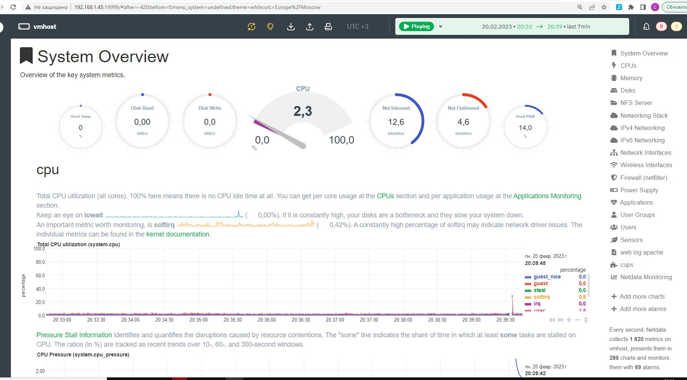

### 1. На лекции мы познакомились с [node_exporter](https://github.com/prometheus/node_exporter/releases). В демонстрации его исполняемый файл запускался в background. Этого достаточно для демо, но не для настоящей production-системы, где процессы должны находиться под внешним управлением. Используя знания из лекции по systemd, создайте самостоятельно простой [unit-файл](https://www.freedesktop.org/software/systemd/man/systemd.service.html) для node_exporter:

    * поместите его в автозагрузку,
    * предусмотрите возможность добавления опций к запускаемому процессу через внешний файл (посмотрите, например, на `systemctl cat cron`),
    * удостоверьтесь, что с помощью systemctl процесс корректно стартует, завершается, а после перезагрузки автоматически поднимается.

```install

user1@vmhost:~$ wget https://github.com/prometheus/node_exporter/releases/download/v1.5.0/node_exporter-1.5.0.linux-amd64.tar.gz

user1@vmhost:~$ tar zxvf node_exporter-1.5.0.linux-amd64.tar.gz

user1@vmhost:~$ rm -f node_exporter-1.5.0.linux-amd64.tar.gz

user1@vmhost:~$ sudo touch /opt/node_exporter.env

user1@vmhost:~$ sudo mv node_exporter-1.5.0.linux-amd64/node_exporter /usr/local/bin/
user1@vmhost:~$ sudo tee /etc/systemd/system/node_exporter.service<<EOF
[Unit]
Description=Node Exporter
After=network.target

[Service]
Type=simple
EnvironmentFile=/opt/node_exporter.env
ExecStart=/usr/local/bin/node_exporter
StandardOutput=file:/var/log/node_explorer.log
StandardError=file:/var/log/node_explorer.log

[Install]
WantedBy=multi-user.target
EOF

user1@vmhost:~$ sudo systemctl daemon-reload

user1@vmhost:~$ sudo systemctl start node_exporter

user1@vmhost:~$ sudo systemctl enable node_exporter

user1@vmhost:~$ sudo systemctl status node_exporter -l
● node_exporter.service - Node Exporter
     Loaded: loaded (/etc/systemd/system/node_exporter.service; enabled; vendor preset: enabled)
     Active: active (running) since Mon 2023-02-20 19:42:04 MSK; 3s ago
   Main PID: 57304 (node_exporter)
      Tasks: 5 (limit: 13913)
     Memory: 2.9M
        CPU: 11ms
     CGroup: /system.slice/node_exporter.service
             └─57304 /usr/local/bin/node_exporter

фев 20 19:42:04 vmhost systemd[1]: Started Node Exporter.

```
----
```option
user1@vmhost:~$ echo "EXTRA_OPTS=\"--log.level=info\"" | sudo tee /opt/node_exporter.env
EXTRA_OPTS="--log.level=info"

user1@vmhost:~$ sudo systemctl restart node_exporter

user1@vmhost:~$ sudo systemctl status node_exporter -l
● node_exporter.service - Node Exporter
     Loaded: loaded (/etc/systemd/system/node_exporter.service; enabled; vendor preset: enabled)
     Active: active (running) since Mon 2023-02-20 19:43:59 MSK; 4s ago
   Main PID: 57479 (node_exporter)
      Tasks: 5 (limit: 13913)
     Memory: 2.7M
        CPU: 10ms
     CGroup: /system.slice/node_exporter.service
             └─57479 /usr/local/bin/node_exporter --log.level=info

фев 20 19:43:59 vmhost systemd[1]: Started Node Exporter.

```
	
	

### 2. Ознакомьтесь с опциями node_exporter и выводом `/metrics` по-умолчанию. Приведите несколько опций, которые вы бы выбрали для базового мониторинга хоста по CPU, памяти, диску и сети.

```bash
user1@vmhost:~$ curl -vvv http://localhost:9100/metrics
*   Trying 127.0.0.1:9100...
* Connected to localhost (127.0.0.1) port 9100 (#0)
> GET /metrics HTTP/1.1
> Host: localhost:9100
> User-Agent: curl/7.81.0
> Accept: */*
>
* Mark bundle as not supporting multiuse
< HTTP/1.1 200 OK
< Content-Type: text/plain; version=0.0.4; charset=utf-8
< Date: Mon, 20 Feb 2023 17:13:12 GMT
< Transfer-Encoding: chunked
<
# HELP go_gc_duration_seconds A summary of the pause duration of garbage collection cycles.
# TYPE go_gc_duration_seconds summary
go_gc_duration_seconds{quantile="0"} 0
go_gc_duration_seconds{quantile="0.25"} 0
go_gc_duration_seconds{quantile="0.5"} 0
---cut---
```
----
	Для базового мониторинга можно использовать опции сбора статистики по CPU, памяти, диску и сети:

	--web.listen-address= - устанавливает адрес и порт для веб-сервера node_exporter. По умолчанию это :9100.
	--collector.cpu.info - включает сбор метрик CPU.
	--collector.meminfo - включает сбор метрик памяти.
	--collector.diskstats - включает сбор метрик диска.
	--collector.netstat - включает сбор метрик сети.


### 3. Установите в свою виртуальную машину [Netdata](https://github.com/netdata/netdata). Воспользуйтесь [готовыми пакетами](https://packagecloud.io/netdata/netdata/install) для установки (`sudo apt install -y netdata`). 

```bash   
После успешной установки: в конфигурационном файле `/etc/netdata/netdata.conf` 
в секции [web] замените значение с localhost на `bind to = 0.0.0.0`, 
добавьте в Vagrantfile проброс порта Netdata на свой локальный компьютер и сделайте `vagrant reload`:
    "config.vm.network "forwarded_port", guest: 19999, host: 19999"
После успешной перезагрузки в браузере *на своем ПК* (не в виртуальной машине) вы должны суметь зайти на `localhost:19999`.
Ознакомьтесь с метриками, которые по умолчанию собираются Netdata и с комментариями, которые даны к этим метрикам.
```


### 4. Можно ли по выводу `dmesg` понять, осознает ли ОС, что загружена не на настоящем оборудовании, а на системе виртуализации?
```dmesg
# dmesg | grep -B2 -i 'Hypervisor detected'
[    0.000000] SMBIOS 2.8 present.
[    0.000000] DMI: Nutanix AHV, BIOS 1.11.0-2.el7 04/01/2014
[    0.000000] Hypervisor detected: KVM

```
```dmesg2
# dmesg | grep -B2 -i 'Hypervisor detected'
[    0.000000] DMI: VMware, Inc. VMware Virtual Platform/440BX Desktop Reference Platform, BIOS 6.00 12/12/2018
[    0.000000] vmware: hypercall mode: 0x00
[    0.000000] Hypervisor detected: VMware

```

### 5. Как настроен sysctl `fs.nr_open` на системе по-умолчанию? Определите, что означает этот параметр. Какой другой существующий лимит не позволит достичь такого числа (`ulimit --help`)?

	user1@vmhost:~$ sysctl fs.nr_open
	fs.nr_open = 1048576
	
	user1@vmhost:~$ ulimit -Hn
	1048576

fs.nr_open - Hard лимит на открытые дескрипторы для системы

	user1@vmhost:~$ ulimit -Sn
	1024

Soft лимит на открытые дескрипторы для пользователя, может быть изменен как большую, так и меньшую сторону

Hard лимит пользователя, может быть изменен только в меньшую сторону
Оба ulimit -n не могут превышать fs.nr_open


### 6. Запустите любой долгоживущий процесс (не `ls`, который отработает мгновенно, а, например, `sleep 1h`) в отдельном неймспейсе процессов; покажите, что ваш процесс работает под PID 1 через `nsenter`. Для простоты работайте в данном задании под root (`sudo -i`). Под обычным пользователем требуются дополнительные опции (`--map-root-user`) и т.д.

```bash
Term1:

user1@vmhost:~$ sudo unshare -f --pid --mount-proc sleep 1h
 
Term2:

user1@vmhost:~$ ps -e | grep sleep
63647 pts/3    00:00:00 sleep
user1@vmhost:~$ sudo nsenter --target 63647 --mount --uts --ipc --net --pid ps aux
USER         PID %CPU %MEM    VSZ   RSS TTY      STAT START   TIME COMMAND
root           1  0.0  0.0   8376  1008 pts/3    S+   21:02   0:00 sleep 1h
root           2  0.0  0.0  14628  4280 pts/7    R+   21:04   0:00 ps aux


```


### 7. Найдите информацию о том, что такое `:(){ :|:& };:`. Запустите эту команду в своей виртуальной машине Vagrant с Ubuntu 20.04 (**это важно, поведение в других ОС не проверялось**). Некоторое время все будет "плохо", после чего (минуты) – ОС должна стабилизироваться. Вызов `dmesg` расскажет, какой механизм помог автоматической стабилизации.  
Как настроен этот механизм по-умолчанию, и как изменить число процессов, которое можно создать в сессии?

*В качестве решения ответьте на вопросы и опишите каким образом эти ответы были получены*

	":(){ :|:& };:" - это так называемый "fork bomb" - команда,
	которая генерирует рекурсивные процессы, 
	заполняя оперативную память и загружая процессор, 
	что может привести к зависанию системы.


Стабилизация системы:

	[Пн фев 20 21:23:48 2023] cgroup: fork rejected by pids controller in /user.slice/user-1000.slice/session-3.scope

Значение TasksMax (изменение значения в %, конкретное число или infinity, чтобы убрать лимит) в /usr/lib/systemd/system/user-.slice.d/10-defaults.conf лимит процессов в сессии
```bash
user1@vmhost:~$ sudo cat /usr/lib/systemd/system/user-.slice.d/10-defaults.conf
#  SPDX-License-Identifier: LGPL-2.1-or-later
#
#  This file is part of systemd.
#
#  systemd is free software; you can redistribute it and/or modify it
#  under the terms of the GNU Lesser General Public License as published by
#  the Free Software Foundation; either version 2.1 of the License, or
#  (at your option) any later version.

[Unit]
Description=User Slice of UID %j
Documentation=man:user@.service(5)
After=systemd-user-sessions.service
StopWhenUnneeded=yes

[Slice]
TasksMax=33%
```


----
