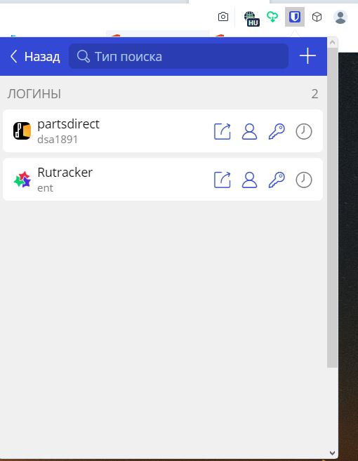
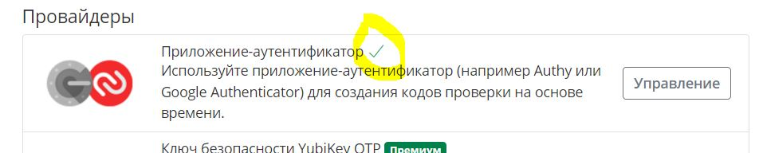
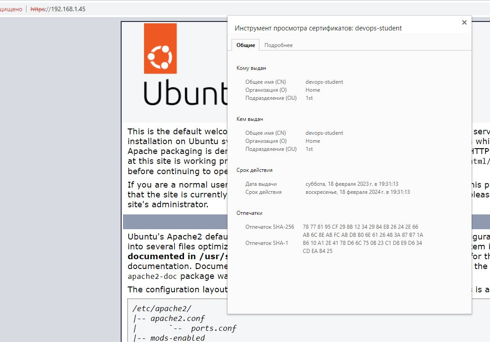
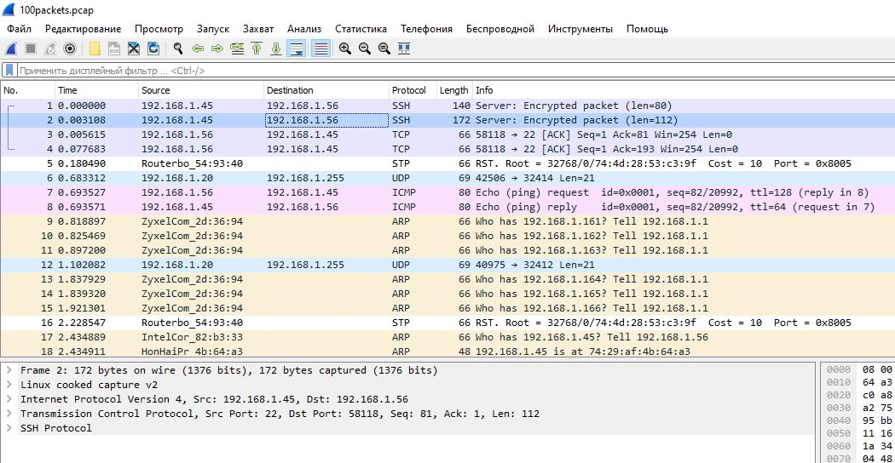

### 1. Установите Bitwarden плагин для браузера. Зарегестрируйтесь и сохраните несколько паролей.



### 2. Установите Google authenticator на мобильный телефон. Настройте вход в Bitwarden акаунт через Google authenticator OTP.



### 3. Установите apache2, сгенерируйте самоподписанный сертификат, настройте тестовый сайт для работы по HTTPS.

	Установил апач, запустил сайт.
	

### 4. Проверьте на TLS уязвимости произвольный сайт в интернете (кроме сайтов МВД, ФСБ, МинОбр, НацБанк, РосКосмос, РосАтом, РосНАНО и любых госкомпаний, объектов КИИ, ВПК ... и тому подобное).

```testssl

~# git clone --depth 1 https://github.com/drwetter/testssl.sh.git
Клонирование в «testssl.sh»…
remote: Enumerating objects: 104, done.
remote: Counting objects: 100% (104/104), done.
remote: Compressing objects: 100% (100/100), done.
remote: Total 104 (delta 14), reused 33 (delta 4), pack-reused 0
Получение объектов: 100% (104/104), 8.70 МиБ | 1.04 МиБ/с, готово.
Определение изменений: 100% (14/14), готово.

~# cd testssl.sh/

~/testssl.sh# ./testssl.sh -U --sneaky https://sysadmin.pm/

###########################################################
    testssl.sh       3.2rc2 from https://testssl.sh/dev/
    (e57527f 2023-02-08 17:07:42)

      This program is free software. Distribution and
             modification under GPLv2 permitted.
      USAGE w/o ANY WARRANTY. USE IT AT YOUR OWN RISK!

       Please file bugs @ https://testssl.sh/bugs/

###########################################################

 Using "OpenSSL 1.0.2-bad (1.0.2k-dev)" [~179 ciphers]
 on vmhost:./bin/openssl.Linux.x86_64
 (built: "Sep  1 14:03:44 2022", platform: "linux-x86_64")


 Start 2023-02-19 12:15:15        -->> 104.244.78.134:443 (sysadmin.pm) <<--

 rDNS (104.244.78.134):  www.sysadmin.pm.
 Service detected:       HTTP


 Testing vulnerabilities

 Heartbleed (CVE-2014-0160)                not vulnerable (OK), no heartbeat extension
 CCS (CVE-2014-0224)                       not vulnerable (OK)
 Ticketbleed (CVE-2016-9244), experiment.  not vulnerable (OK), no session ticket extension
 ROBOT                                     not vulnerable (OK)
 Secure Renegotiation (RFC 5746)           supported (OK)
 Secure Client-Initiated Renegotiation     not vulnerable (OK)
 CRIME, TLS (CVE-2012-4929)                not vulnerable (OK)
 BREACH (CVE-2013-3587)                    potentially NOT ok, "gzip" HTTP compression detected. - only supplied "/" tested
                                           Can be ignored for static pages or if no secrets in the page
 POODLE, SSL (CVE-2014-3566)               not vulnerable (OK)
 TLS_FALLBACK_SCSV (RFC 7507)              No fallback possible (OK), no protocol below TLS 1.2 offered
 SWEET32 (CVE-2016-2183, CVE-2016-6329)    not vulnerable (OK)
 FREAK (CVE-2015-0204)                     not vulnerable (OK)
 DROWN (CVE-2016-0800, CVE-2016-0703)      not vulnerable on this host and port (OK)
                                           make sure you don't use this certificate elsewhere with SSLv2 enabled services, see
                                           https://search.censys.io/search?resource=hosts&virtual_hosts=INCLUDE&q=796CCF4B8582D08380F5989CE5E6656CC3A559F47799E76E58982098FEAD315A
 LOGJAM (CVE-2015-4000), experimental      not vulnerable (OK): no DH EXPORT ciphers, no DH key detected with <= TLS 1.2
 BEAST (CVE-2011-3389)                     not vulnerable (OK), no SSL3 or TLS1
 LUCKY13 (CVE-2013-0169), experimental     potentially VULNERABLE, uses cipher block chaining (CBC) ciphers with TLS. Check patches
 Winshock (CVE-2014-6321), experimental    not vulnerable (OK)
 RC4 (CVE-2013-2566, CVE-2015-2808)        no RC4 ciphers detected (OK)


 Done 2023-02-19 12:15:54 [  43s] -->> 104.244.78.134:443 (sysadmin.pm) <<--


```		

### 5. Установите на Ubuntu ssh сервер, сгенерируйте новый приватный ключ. Скопируйте свой публичный ключ на другой сервер. Подключитесь к серверу по SSH-ключу.

```sshkey

user1@vmhost:~$ ssh-keygen
Generating public/private rsa key pair.
Enter file in which to save the key (/home/user1/.ssh/id_rsa):
Created directory '/home/user1/.ssh'.
Enter passphrase (empty for no passphrase):
Enter same passphrase again:
Your identification has been saved in /home/user1/.ssh/id_rsa
Your public key has been saved in /home/user1/.ssh/id_rsa.pub
The key fingerprint is:
SHA256:v07F32hDwKtm6+7lB08iddcCjR/DnUwX3/2myoWUxNI user1@vmhost
The key's randomart image is:
+---[RSA 3072]----+
|             +o++|
|           +o =o*|
|          . Eo o=|
|           +.++ +|
|        S  .*..oo|
|         ..+o+.= |
|          *.o=B .|
|         + * +o. |
|         =B +.   |
+----[SHA256]-----+

user1@vmhost:~$ ssh-copy-id user2@192.168.1.45
/usr/bin/ssh-copy-id: INFO: Source of key(s) to be installed: "/home/user1/.ssh/id_rsa.pub"
The authenticity of host '192.168.1.45 (192.168.1.45)' can't be established.
ED25519 key fingerprint is SHA256:fVUaVkSFyRDlGT2RG59RWB5un7k8OMnjnDGLIo23BL4.
This key is not known by any other names
Are you sure you want to continue connecting (yes/no/[fingerprint])? yes
/usr/bin/ssh-copy-id: INFO: attempting to log in with the new key(s), to filter out any that are already installed
/usr/bin/ssh-copy-id: INFO: 1 key(s) remain to be installed -- if you are prompted now it is to install the new keys
user2@192.168.1.45's password:

Number of key(s) added: 1

Now try logging into the machine, with:   "ssh 'user2@192.168.1.45'"
and check to make sure that only the key(s) you wanted were added.


user1@vmhost:~$ ssh user2@192.168.1.45
Welcome to Ubuntu 22.04.1 LTS (GNU/Linux 5.15.0-58-generic x86_64)

 * Documentation:  https://help.ubuntu.com
 * Management:     https://landscape.canonical.com
 * Support:        https://ubuntu.com/advantage

49 обновлений может быть применено немедленно.
Чтобы просмотреть дополнительные обновления выполните: apt list --upguser2ble


1 updates could not be installed automatically. For more details,
see /var/log/unattended-upgrades/unattended-upgrades.log
*** System restart required ***
Last login: Sun Feb 19 12:04:52 2023 from 192.168.1.56

user2@vmhost2:~$
user2@vmhost2:~$ id
uid=1000(user2) gid=1000(user2) группы=1000(user2),4(adm),24(cdrom),27(sudo),30(dip),46(plugdev),116(lpadmin),126(sambashare)


```


### 6. Переименуйте файлы ключей из задания 5. Настройте файл конфигурации SSH клиента, так чтобы вход на удаленный сервер осуществлялся по имени сервера.

```sshrename
user1@vmhost1:~$ mv ~/.ssh/id_rsa ~/.ssh/id_rsa_netology
user1@vmhost1:~$ vi ~/.ssh/config


user1@vmhost:~$ ssh vmhost2
Welcome to Ubuntu 22.04.1 LTS (GNU/Linux 5.15.0-58-generic x86_64)

 * Documentation:  https://help.ubuntu.com
 * Management:     https://landscape.canonical.com
 * Support:        https://ubuntu.com/advantage

49 обновлений может быть применено немедленно.
Чтобы просмотреть дополнительные обновления выполните: apt list --upguser2ble


1 updates could not be installed automatically. For more details,
see /var/log/unattended-upgrades/unattended-upgrades.log
*** System restart required ***
Last login: Sun Feb 19 13:31:55 2023 from 192.168.1.45

user2@vmhost2:~$
user2@vmhost2:~$ id
uid=1000(user2) gid=1000(user2) группы=1000(user2),4(adm),24(cdrom),27(sudo),30(dip),46(plugdev),116(lpadmin),126(sambashare)


```
	

### 7. Соберите дамп трафика утилитой tcpdump в формате pcap, 100 пакетов. Откройте файл pcap в Wireshark.

```tcpdump
~# tcpdump -nnei any -c 100 -w 100packets.pcap
tcpdump: data link type LINUX_SLL2
tcpdump: listening on any, link-type LINUX_SLL2 (Linux cooked v2), snapshot length 262144 bytes
100 packets captured
102 packets received by filter
0 packets dropped by kernel
root@t450s:~# cp -v 100packets.pcap /home/sergio/
'100packets.pcap' -> '/home/sergio/100packets.pcap'

```
