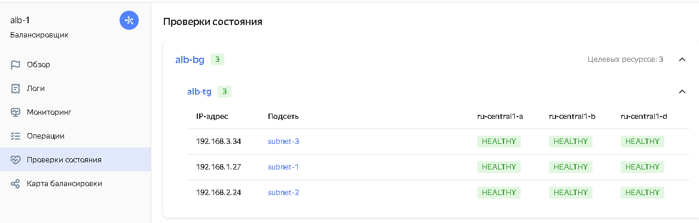

# Домашнее задание к занятию «Вычислительные мощности. Балансировщики нагрузки»  

---
## Задание 1. Yandex Cloud 

**Что нужно сделать**

1. Создать бакет Object Storage и разместить в нём файл с картинкой:

 - Создать бакет в Object Storage с произвольным именем (например, _имя_студента_дата_).
- ***Создан, но имя бакета применил сгенерированное.*** 
 ```
 > yc storage bucket list
+----------------------------------+----------------------+----------+-----------------------+---------------------+
|               NAME               |      FOLDER ID       | MAX SIZE | DEFAULT STORAGE CLASS |     CREATED AT      |
+----------------------------------+----------------------+----------+-----------------------+---------------------+
| wahthohjeejooph0phoaleecav4ifee7 | b1gp70dskovujsl7c4tu |     1024 | STANDARD              | 2024-04-18 10:00:07 |
+----------------------------------+----------------------+----------+-----------------------+---------------------+
 ```
 - Положить в бакет файл с картинкой.
- ***Объект сохранен.*** 
```
> yc storage bucket stats wahthohjeejooph0phoaleecav4ifee7
name: wahthohjeejooph0phoaleecav4ifee7
max_size: "1024"
used_size: "246067"
storage_class_used_sizes:
  - storage_class: STANDARD
    class_size: "246067"
storage_class_counters:
  - storage_class: STANDARD
    counters:
      simple_object_size: "246067"
      simple_object_count: "1"
default_storage_class: STANDARD
anonymous_access_flags:
  read: true
  list: true
  config_read: false
created_at: "2024-04-18T10:00:07.334602Z"
updated_at: "2024-04-18T10:08:01.541428Z"

``` 
 - Сделать файл доступным из интернета.
 - ***Файл доступен к загрузке из интернета, проверил загрузку командой wget.***
 ```
~/terraform/yandex/lab15.2> wget https://storage.yandexcloud.net/wahthohjeejooph0phoaleecav4ifee7/soveshanie.png
--2024-04-18 15:05:10--  https://storage.yandexcloud.net/wahthohjeejooph0phoaleecav4ifee7/soveshanie.png
Распознаётся storage.yandexcloud.net (storage.yandexcloud.net)… 213.180.193.243, 2a02:6b8::1d9
Подключение к storage.yandexcloud.net (storage.yandexcloud.net)|213.180.193.243|:443... соединение установлено.
HTTP-запрос отправлен. Ожидание ответа… 200 OK
Длина: 246067 (240K) [application/octet-stream]
Сохранение в: «soveshanie.png.1»

soveshanie.png.1                               100%[=================================================================================================>] 240,30K  --.-KB/s    за 0,02s

2024-04-18 15:05:11 (12,7 MB/s) - «soveshanie.png.1» сохранён [246067/246067]


~/terraform/yandex/lab15.2> ls -lah soveshanie.png.1
-rw-r--r-- 1 sergio users 241K апр 18 13:00 soveshanie.png.1
 ```
 
2. Создать группу ВМ в public подсети фиксированного размера с шаблоном LAMP и веб-страницей, содержащей ссылку на картинку из бакета:

 - Создать Instance Group с тремя ВМ и шаблоном LAMP. Для LAMP рекомендуется использовать `image_id = fd827b91d99psvq5fjit`.
```
~/terraform/yandex/lab15.2> yc compute instance-group list
+----------------------+--------+--------+------+
|          ID          |  NAME  | STATUS | SIZE |
+----------------------+--------+--------+------+
| cl1g2brftmvsssl20r25 | lab-ig | ACTIVE |    3 |
+----------------------+--------+--------+------+
```
```
~/terraform/yandex/lab15.2> yc compute instance-group list-instances --id cl1g2brftmvsssl20r25
+----------------------+---------------------------+-----------------+---------------+---------------------+----------------+
|     INSTANCE ID      |           NAME            |   EXTERNAL IP   |  INTERNAL IP  |       STATUS        | STATUS MESSAGE |
+----------------------+---------------------------+-----------------+---------------+---------------------+----------------+
| fhmnfvik2mus083jio7n | cl1g2brftmvsssl20r25-ozef | 178.154.204.25  | 192.168.10.7  | RUNNING_ACTUAL [9m] |                |
| fhm6bj5mcr51fnr74b9c | cl1g2brftmvsssl20r25-ulew | 178.154.205.62  | 192.168.10.31 | RUNNING_ACTUAL [9m] |                |
| fhmrbn7knobs12rdndq4 | cl1g2brftmvsssl20r25-udef | 178.154.221.231 | 192.168.10.24 | RUNNING_ACTUAL [8m] |                |
+----------------------+---------------------------+-----------------+---------------+---------------------+----------------+
```
```
~/terraform/yandex/lab15.2> yc compute instance-group get --id cl1g2brftmvsssl20r25
id: cl1g2brftmvsssl20r25
folder_id: b1gp70dskovujsl7c4tu
created_at: "2024-04-19T10:55:18.518Z"
name: lab-ig
instance_template:
  platform_id: standard-v1
  resources_spec:
    memory: "2147483648"
    cores: "2"
    core_fraction: "100"
  boot_disk_spec:
    mode: READ_WRITE
    disk_spec:
      type_id: network-hdd
      size: "4294967296"
      image_id: fd827b91d99psvq5fjit
  network_interface_specs:
    - network_id: enp77mh4snkqtleq744p
      subnet_ids:
        - e9bvgl29trotnpa1rpo4
      primary_v4_address_spec:
        one_to_one_nat_spec:
          ip_version: IPV4
  scheduling_policy:
    preemptible: true
  metadata_options: {}
scale_policy:
  fixed_scale:
    size: "3"
deploy_policy:
  max_unavailable: "2"
  max_deleting: "2"
  max_creating: "2"
  max_expansion: "2"
  strategy: PROACTIVE
allocation_policy:
  zones:
    - zone_id: ru-central1-a
load_balancer_state:
  target_group_id: enp776stk5ps8rr08sid
managed_instances_state:
  target_size: "3"
  running_actual_count: "3"
load_balancer_spec:
  target_group_spec:
    name: target-group
    description: Целевая группа Network Load Balancer
service_account_id: aje0507h05gfcud0l46i
status: ACTIVE
application_load_balancer_state: {}

```
 
 - Для создания стартовой веб-страницы рекомендуется использовать раздел `user_data` в [meta_data](https://cloud.yandex.ru/docs/compute/concepts/vm-metadata).
 - Разместить в стартовой веб-странице шаблонной ВМ ссылку на картинку из бакета.
 - Настроить проверку состояния ВМ.
 
3. Подключить группу к сетевому балансировщику:

 - Создать сетевой балансировщик.
```
~/terraform/yandex/lab15.2> yc lb nlb list
+----------------------+-------------------------+-------------+----------+----------------+------------------------+--------+
|          ID          |          NAME           |  REGION ID  |   TYPE   | LISTENER COUNT | ATTACHED TARGET GROUPS | STATUS |
+----------------------+-------------------------+-------------+----------+----------------+------------------------+--------+
| enp16j5mb9cd1p8pusrm | network-load-balancer-1 | ru-central1 | EXTERNAL |              1 | enp776stk5ps8rr08sid   | ACTIVE |
+----------------------+-------------------------+-------------+----------+----------------+------------------------+--------+
```
```
~/terraform/yandex/lab15.2> yc lb nlb get enp16j5mb9cd1p8pusrm
id: enp16j5mb9cd1p8pusrm
folder_id: b1gp70dskovujsl7c4tu
created_at: "2024-04-19T10:57:31Z"
name: network-load-balancer-1
region_id: ru-central1
status: ACTIVE
type: EXTERNAL
listeners:
  - name: network-load-balancer-1-listener
    address: 158.160.151.227
    port: "80"
    protocol: TCP
    target_port: "80"
    ip_version: IPV4
attached_target_groups:
  - target_group_id: enp776stk5ps8rr08sid
    health_checks:
      - name: http
        interval: 2s
        timeout: 1s
        unhealthy_threshold: "2"
        healthy_threshold: "2"
        http_options:
          port: "80"
          path: /index.html

```
```
~/terraform/yandex/lab15.2> yc lb tg list
+----------------------+--------------+---------------------+-------------+--------------+
|          ID          |     NAME     |       CREATED       |  REGION ID  | TARGET COUNT |
+----------------------+--------------+---------------------+-------------+--------------+
| enp776stk5ps8rr08sid | target-group | 2024-04-19 10:55:23 | ru-central1 |            3 |
+----------------------+--------------+---------------------+-------------+--------------+
``` 
 - Проверить работоспособность, удалив одну или несколько ВМ.
 
```
~/terraform/yandex/lab15.2> yc compute instance list
+----------------------+---------------------------+---------------+---------+-----------------+---------------+
|          ID          |           NAME            |    ZONE ID    | STATUS  |   EXTERNAL IP   |  INTERNAL IP  |
+----------------------+---------------------------+---------------+---------+-----------------+---------------+
| fhmga3a36tt1ird0s8a6 | cl1g2brftmvsssl20r25-ozef | ru-central1-a | RUNNING | 158.160.119.222 | 192.168.10.16 |
| fhmpdg5m1p21l6pq85mf | cl1g2brftmvsssl20r25-udef | ru-central1-a | RUNNING | 178.154.203.222 | 192.168.10.7  |
| fhmtf608pb0lipejj0m0 | cl1g2brftmvsssl20r25-ulew | ru-central1-a | RUNNING | 158.160.48.195  | 192.168.10.5  |
+----------------------+---------------------------+---------------+---------+-----------------+---------------+

~/terraform/yandex/lab15.2> yc compute instance delete fhmga3a36tt1ird0s8a6 fhmpdg5m1p21l6pq85mf
'fhmga3a36tt1ird0s8a6' is deleting
done (56s)
'fhmpdg5m1p21l6pq85mf' is deleting
done (55s)

~/terraform/yandex/lab15.2> yc compute instance list
+----------------------+---------------------------+---------------+--------------+----------------+--------------+
|          ID          |           NAME            |    ZONE ID    |    STATUS    |  EXTERNAL IP   | INTERNAL IP  |
+----------------------+---------------------------+---------------+--------------+----------------+--------------+
| fhmg1fot7n7bh1oged5l | cl1g2brftmvsssl20r25-ozef | ru-central1-a | PROVISIONING | 158.160.55.80  | 192.168.10.3 |
| fhmtf608pb0lipejj0m0 | cl1g2brftmvsssl20r25-ulew | ru-central1-a | RUNNING      | 158.160.48.195 | 192.168.10.5 |
+----------------------+---------------------------+---------------+--------------+----------------+--------------+

~/terraform/yandex/lab15.2> curl 158.160.151.227
<h1>Hello World, this is LAB15.2 pic in Yandex bject Storage </h1>
<html></html>
``` 
 
4. (дополнительно)* Создать Application Load Balancer с использованием Instance group и проверкой состояния.
```
~/terraform/yandex/alb-ha-site> yc application-load-balancer lb list
+----------------------+-------+-----------+----------------+--------+
|          ID          | NAME  | REGION ID | LISTENER COUNT | STATUS |
+----------------------+-------+-----------+----------------+--------+
| ds79anmk3nt76b9j5mj7 | alb-1 |           |              1 | ACTIVE |
+----------------------+-------+-----------+----------------+--------+
```
```
~/terraform/yandex/alb-ha-site> yc application-load-balancer lb get alb-1
id: ds79anmk3nt76b9j5mj7
name: alb-1
folder_id: b1gp70dskovujsl7c4tu
status: ACTIVE
network_id: enpe2hl7a57urqac4fag
listeners:
  - name: alb-listener
    endpoints:
      - addresses:
          - external_ipv4_address:
              address: 158.160.164.99
        ports:
          - "80"
    http:
      handler:
        http_router_id: ds73nije6hsm5pke8u85
allocation_policy:
  locations:
    - zone_id: ru-central1-a
      subnet_id: e9bvrr79jerel5p860em
    - zone_id: ru-central1-b
      subnet_id: e2lp5r0phvqs73tusc91
    - zone_id: ru-central1-d
      subnet_id: fl83j20rdurc9ailf7h7
security_group_ids:
  - enp76c28phdjskkds080
created_at: "2024-04-21T07:01:39.785707041Z"
```
```
~/terraform/yandex/alb-ha-site> yc application-load-balancer http-router list
+----------------------+------------+-------------+-------------+
|          ID          |    NAME    | VHOST COUNT | ROUTE COUNT |
+----------------------+------------+-------------+-------------+
| ds73nije6hsm5pke8u85 | alb-router |           1 |           1 |
+----------------------+------------+-------------+-------------+

```
```
~/terraform/yandex/alb-ha-site> yc application-load-balancer virtual-host list --http-router-id=ds73nije6hsm5pke8u85
+----------+--------------------------------+-------------+---------------------+
|   NAME   |          AUTHORITIES           | ROUTE COUNT | SECURITY PROFILE ID |
+----------+--------------------------------+-------------+---------------------+
| alb-host | www.alb-example.com.,          |           1 |                     |
|          | alb-example.com.               |             |                     |
+----------+--------------------------------+-------------+---------------------+
```
```
~/terraform/yandex/alb-ha-site> yc application-load-balancer http-router get ds73nije6hsm5pke8u85
id: ds73nije6hsm5pke8u85
name: alb-router
folder_id: b1gp70dskovujsl7c4tu
virtual_hosts:
  - name: alb-host
    authority:
      - www.alb-example.com.
      - alb-example.com.
    routes:
      - name: route-1
        http:
          route:
            backend_group_id: ds7r86lqpdrkkpeopvpi
created_at: "2024-04-21T06:57:30.652389355Z"
```
```
~/terraform/yandex/alb-ha-site> yc compute instance-group list
+----------------------+--------------+--------+------+
|          ID          |     NAME     | STATUS | SIZE |
+----------------------+--------------+--------+------+
| cl19jtus5lvh3ilonreu | alb-vm-group | ACTIVE |    3 |
+----------------------+--------------+--------+------+

~/terraform/yandex/alb-ha-site> yc compute instance list
+----------------------+---------------------------+---------------+---------+----------------+--------------+
|          ID          |           NAME            |    ZONE ID    | STATUS  |  EXTERNAL IP   | INTERNAL IP  |
+----------------------+---------------------------+---------------+---------+----------------+--------------+
| epd91bm2vaopudp5rsg7 | cl19jtus5lvh3ilonreu-ikoq | ru-central1-b | RUNNING | 158.160.73.58  | 192.168.2.24 |
| fhm20r24m3boj0d06bpj | cl19jtus5lvh3ilonreu-iwyb | ru-central1-a | RUNNING | 158.160.116.64 | 192.168.1.27 |
| fv419uu22mqic4o345p9 | cl19jtus5lvh3ilonreu-urib | ru-central1-d | RUNNING | 158.160.146.63 | 192.168.3.34 |
+----------------------+---------------------------+---------------+---------+----------------+--------------+
```
```
~/terraform/yandex/alb-ha-site> curl  158.160.164.99

request-id: 8389606b-ed6e-4411-b0c9-96aa4ee1178b

```


-----
- ***Манифест для задания 1.1 [storage.tf](./files/lab2/storage.tf)***
- ***Манифест для задания 1.2 [main.tf](./files/lab2/main.tf)***
- ***Манифест для задания 1.3 [nlb.tf](./files/lab2/nlb.tf)***
- ***Манифест для задания 1.4* [app-lb.tf](./files/lab2.4/app-lb.tf)***
-----

Полезные документы:

- [Compute instance group](https://registry.terraform.io/providers/yandex-cloud/yandex/latest/docs/resources/compute_instance_group).
- [Network Load Balancer](https://registry.terraform.io/providers/yandex-cloud/yandex/latest/docs/resources/lb_network_load_balancer).
- [Группа ВМ с сетевым балансировщиком](https://cloud.yandex.ru/docs/compute/operations/instance-groups/create-with-balancer).
- [Отказоустойчивый сайт с балансировкой нагрузки с помощью Yandex Application Load Balancer](https://yandex.cloud/ru/docs/tutorials/web/application-load-balancer-website)
---

Пример bootstrap-скрипта:

```
#!/bin/bash
yum install httpd -y
service httpd start
chkconfig httpd on
cd /var/www/html
echo "<html><h1>My cool web-server</h1></html>" > index.html
```
