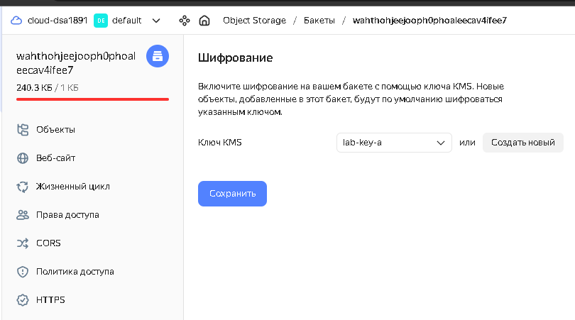
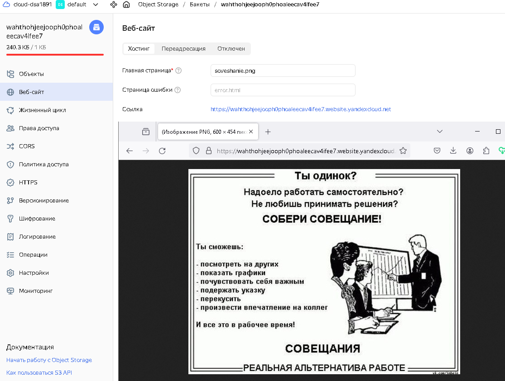

# Домашнее задание к занятию «Безопасность в облачных провайдерах»  

---
## Задание 1. Yandex Cloud   

1. С помощью ключа в KMS необходимо зашифровать содержимое бакета:

 - создать ключ в KMS;
- ***Создан [kms.tf](./files/lab3/kms.tf)*** 
```
~/terraform/yandex/cert> yc kms symmetric-key list
+----------------------+-----------+----------------------+-------------------+---------------------+--------+
|          ID          |   NAME    |  PRIMARY VERSION ID  | DEFAULT ALGORITHM |     CREATED AT      | STATUS |
+----------------------+-----------+----------------------+-------------------+---------------------+--------+
| abjf852kc88uapg9hpdi | lab-key-a | abjbr5d021605amnum6j | AES_128           | 2024-04-23 04:48:40 | ACTIVE |
+----------------------+-----------+----------------------+-------------------+---------------------+--------+
``` 
 - с помощью ключа зашифровать содержимое бакета, созданного ранее.

- ***Сделано в [storage.tf](./files/lab3/storage.tf#L32)*** 




2. (Выполняется не в Terraform)* Создать статический сайт в Object Storage c собственным публичным адресом и сделать доступным по HTTPS:

 - создать сертификат;
- ***Создан [cert.tf](./files/lab3/cert.tf)***
 
```
~/terraform/yandex/cert> yc certificate-manager certificate list
+----------------------+----------+----------------------------------+---------------------+----------+--------+
|          ID          |   NAME   |             DOMAINS              |      NOT AFTER      |   TYPE   | STATUS |
+----------------------+----------+----------------------------------+---------------------+----------+--------+
| fpqvnt5e4ep0dtpo43ut | lab-cert | wahthohjeejooph0phoaleecav4ifee7 | 2025-04-22 12:52:44 | IMPORTED | ISSUED |
+----------------------+----------+----------------------------------+---------------------+----------+--------+
``` 
 - создать статическую страницу в Object Storage и применить сертификат HTTPS;
- ***Сайт создан, в качестве стартовой страницы указана картинка из S3 bucket, выбран сертификат добавленный ранее*** 
```
~/terraform/yandex/cert> yc storage bucket list
+----------------------------------+----------------------+----------+-----------------------+---------------------+
|               NAME               |      FOLDER ID       | MAX SIZE | DEFAULT STORAGE CLASS |     CREATED AT      |
+----------------------------------+----------------------+----------+-----------------------+---------------------+
| wahthohjeejooph0phoaleecav4ifee7 | b1gp70dskovujsl7c4tu |     1024 | STANDARD              | 2024-04-23 04:33:29 |
+----------------------------------+----------------------+----------+-----------------------+---------------------+
```
```
~/terraform/yandex/cert> yc storage bucket get-https --name wahthohjeejooph0phoaleecav4ifee7
name: wahthohjeejooph0phoaleecav4ifee7
source_type: SOURCE_TYPE_MANAGED_BY_CERTIFICATE_MANAGER
certificate_id: fpqvnt5e4ep0dtpo43ut

```
 - в качестве результата предоставить скриншот на страницу с сертификатом в заголовке (замочек).
 

 

Полезные документы:

- [Настройка HTTPS статичного сайта](https://cloud.yandex.ru/docs/storage/operations/hosting/certificate).
- [Object Storage bucket](https://registry.terraform.io/providers/yandex-cloud/yandex/latest/docs/resources/storage_bucket).
- [KMS key](https://registry.terraform.io/providers/yandex-cloud/yandex/latest/docs/resources/kms_symmetric_key).

--- 

Пример bootstrap-скрипта:

```
#!/bin/bash
yum install httpd -y
service httpd start
chkconfig httpd on
cd /var/www/html
echo "<html><h1>My cool web-server</h1></html>" > index.html
aws s3 mb s3://mysuperbacketname2021
aws s3 cp index.html s3://mysuperbacketname2021
```
