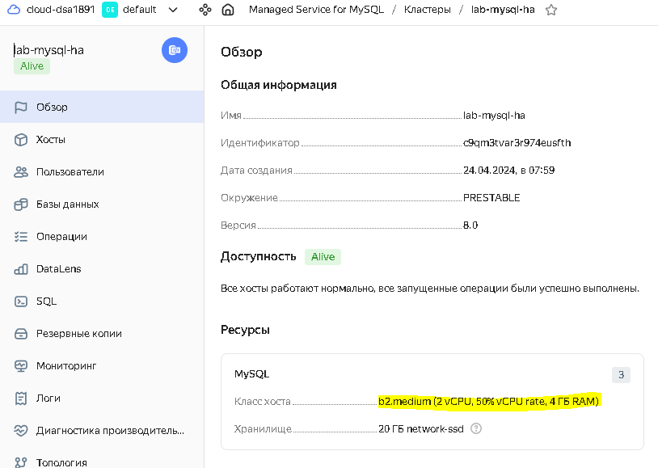
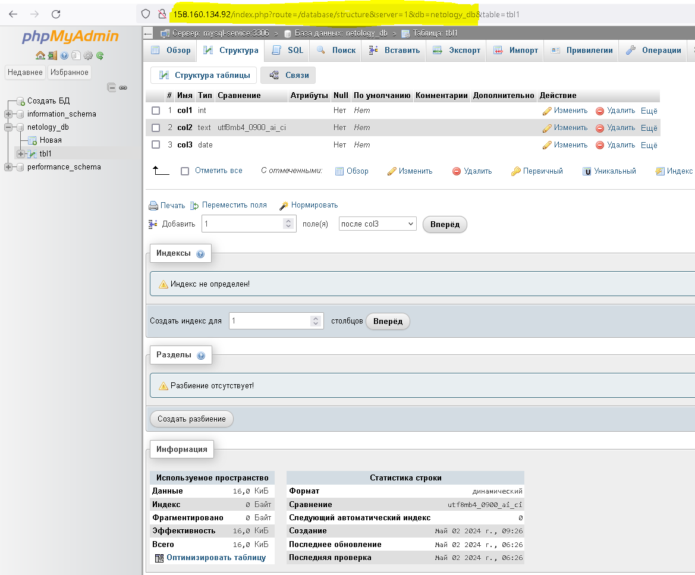

# Домашнее задание к занятию «Кластеры. Ресурсы под управлением облачных провайдеров»

### Цели задания 

1. Организация кластера Kubernetes и кластера баз данных MySQL в отказоустойчивой архитектуре.
2. Размещение в private подсетях кластера БД, а в public — кластера Kubernetes.

---
## Задание 1. Yandex Cloud

1. **Настроить с помощью Terraform кластер баз данных MySQL.**

 - Используя настройки VPC из предыдущих домашних заданий, добавить дополнительно подсеть private в разных зонах, чтобы обеспечить отказоустойчивость. 
```
~/terraform/yandex/lab15.4> yc vpc subnet list
+----------------------+----------------------+----------------------+----------------------+---------------+-------------------+
|          ID          |         NAME         |      NETWORK ID      |    ROUTE TABLE ID    |     ZONE      |       RANGE       |
+----------------------+----------------------+----------------------+----------------------+---------------+-------------------+
| e2lt8sk0ncpql6sd59dp | lab-private-subnet-b | enplepjuef2cknu6o6n1 | enp7ic8jnmjmbed93hjf | ru-central1-b | [192.168.20.0/24] |
| e9bble5i9ufiqkojs9vp | lab-private-subnet-a | enplepjuef2cknu6o6n1 | enp7ic8jnmjmbed93hjf | ru-central1-a | [192.168.10.0/24] |
| e9bok5ta4oi81qenf7o0 | public               | enplepjuef2cknu6o6n1 |                      | ru-central1-a | [192.168.0.0/24]  |
| fl8b2vdl5jtknal1b9mi | lab-private-subnet-d | enplepjuef2cknu6o6n1 | enp7ic8jnmjmbed93hjf | ru-central1-d | [192.168.30.0/24] |
+----------------------+----------------------+----------------------+----------------------+---------------+-------------------+

``` 
 - Разместить ноды кластера MySQL в разных подсетях.
```
~/terraform/yandex/lab15.4> yc managed-mysql cluster list
+----------------------+--------------+---------------------+--------+---------+
|          ID          |     NAME     |     CREATED AT      | HEALTH | STATUS  |
+----------------------+--------------+---------------------+--------+---------+
| c9qm3tvar3r974eusfth | lab-mysql-ha | 2024-04-24 04:59:03 | ALIVE  | RUNNING |
+----------------------+--------------+---------------------+--------+---------+
```
```
~/terraform/yandex/lab15.4> yc managed-mysql hosts list --cluster-name lab-mysql-ha
+-------------------------------------------+----------------------+---------+--------+---------------+-----------+--------------------+----------+-----------------+
|                   NAME                    |      CLUSTER ID      |  ROLE   | HEALTH |    ZONE ID    | PUBLIC IP | REPLICATION SOURCE | PRIORITY | BACKUP PRIORITY |
+-------------------------------------------+----------------------+---------+--------+---------------+-----------+--------------------+----------+-----------------+
| rc1a-3d4ihmgf1lk0gbgz.mdb.yandexcloud.net | c9qm3tvar3r974eusfth | MASTER  | ALIVE  | ru-central1-a | false     |                    |        0 |               0 |
| rc1b-v7u0v555r5gi6l1d.mdb.yandexcloud.net | c9qm3tvar3r974eusfth | REPLICA | ALIVE  | ru-central1-b | false     |                    |        0 |               0 |
| rc1d-pydxlvpv6f66rf2d.mdb.yandexcloud.net | c9qm3tvar3r974eusfth | REPLICA | ALIVE  | ru-central1-d | false     |                    |        0 |               0 |
+-------------------------------------------+----------------------+---------+--------+---------------+-----------+--------------------+----------+-----------------+
```
 - Необходимо предусмотреть репликацию с произвольным временем технического обслуживания.
	- ***Установил произвольное время обслуживания в [mdb.tf](./files/lab4/mdb.tf#L15)***
 - Использовать окружение Prestable, платформу Intel Broadwell с производительностью 50% CPU и размером диска 20 Гб.
 
	 
 - Задать время начала резервного копирования — 23:59.
	- ***Установил время бэкапа в [mdb.tf](./files/lab4/mdb.tf#L19)*** 
 - Включить защиту кластера от непреднамеренного удаления.
	- ***Включил deletion_protection в [mdb.tf](./files/lab4/mdb.tf#L7)*** 
 - Создать БД с именем `netology_db`, логином и паролем.
```
~/terraform/yandex/lab15.4> yc managed-mysql database list --cluster-name lab-mysql-ha
+-------------+----------------------+
|    NAME     |      CLUSTER ID      |
+-------------+----------------------+
| netology_db | c9qm3tvar3r974eusfth |
+-------------+----------------------+
``` 
```
root@lab-vm-nat-0:~# mkdir -p ~/.mysql && \
> wget "https://storage.yandexcloud.net/cloud-certs/CA.pem" \
>    --output-document ~/.mysql/root.crt && \
> chmod 0600 ~/.mysql/root.crt
--2024-04-24 05:51:08--  https://storage.yandexcloud.net/cloud-certs/CA.pem
Resolving storage.yandexcloud.net (storage.yandexcloud.net)... 213.180.193.243, 2a02:6b8::1d9
Connecting to storage.yandexcloud.net (storage.yandexcloud.net)|213.180.193.243|:443... connected.
HTTP request sent, awaiting response... 200 OK
Length: 3579 (3.5K) [application/x-x509-ca-cert]
Saving to: ‘/root/.mysql/root.crt’

/root/.mysql/root.crt                               100%[=================================================================================================================>]   3.50K  --.-KB/s    in 0s

2024-04-24 05:51:08 (388 MB/s) - ‘/root/.mysql/root.crt’ saved [3579/3579]
```
```
root@lab-vm-nat-0:~# mysql --host=rc1a-3d4ihmgf1lk0gbgz.mdb.yandexcloud.net \
>       --port=3306 \
>       --ssl-ca=~/.mysql/root.crt \
>       --ssl-mode=VERIFY_IDENTITY \
>       --user=user1 \
>       --password \
>       netology_db
Enter password:
Welcome to the MySQL monitor.  Commands end with ; or \g.
Your MySQL connection id is 895
Server version: 8.0.35-27 Percona Server (GPL), Revision 03dc548

Copyright (c) 2000, 2023, Oracle and/or its affiliates.

Oracle is a registered trademark of Oracle Corporation and/or its
affiliates. Other names may be trademarks of their respective
owners.

Type 'help;' or '\h' for help. Type '\c' to clear the current input statement.

mysql> show databases;
+--------------------+
| Database           |
+--------------------+
| information_schema |
| netology_db        |
| performance_schema |
+--------------------+
3 rows in set (0.01 sec)
```
---
2. **Настроить с помощью Terraform кластер Kubernetes.**

 - Используя настройки VPC из предыдущих домашних заданий, добавить дополнительно две подсети public в разных зонах, чтобы обеспечить отказоустойчивость.
```
~/terraform/yandex/lab15.4> yc vpc subnet list
+----------------------+-----------------------------------------------------------+----------------------+----------------------+---------------+-------------------+
|          ID          |                           NAME                            |      NETWORK ID      |    ROUTE TABLE ID    |     ZONE      |       RANGE       |
+----------------------+-----------------------------------------------------------+----------------------+----------------------+---------------+-------------------+
| e2l6g6jjbo4mc5g19pet | lab-public-subnet-b                                       | enpth39gpocf83gptaav |                      | ru-central1-b | [192.168.1.0/24]  |
| e2lppitf0co1mno66cfu | lab-private-subnet-b                                      | enpth39gpocf83gptaav | enprdthbhe1titelmnld | ru-central1-b | [192.168.20.0/24] |
| e9b49cmprj5gqm0etk2k | k8s-cluster-cat9ins1186uo9m58hjl-pod-cidr-reservation     | enpth39gpocf83gptaav |                      | ru-central1-a | [10.112.0.0/16]   |
| e9bp1p24fgv0edrk9t6n | k8s-cluster-cat9ins1186uo9m58hjl-service-cidr-reservation | enpth39gpocf83gptaav |                      | ru-central1-a | [10.96.0.0/16]    |
| e9btqtmn47dmdil89u3c | lab-private-subnet-a                                      | enpth39gpocf83gptaav | enprdthbhe1titelmnld | ru-central1-a | [192.168.10.0/24] |
| e9bvjgue4ijmo14i3m7c | lab-public-subnet-a                                       | enpth39gpocf83gptaav |                      | ru-central1-a | [192.168.0.0/24]  |
| fl8b9sm1hf2bqrisukc0 | lab-private-subnet-d                                      | enpth39gpocf83gptaav | enprdthbhe1titelmnld | ru-central1-d | [192.168.30.0/24] |
| fl8cdm7iia1hkil5vvaf | lab-public-subnet-d                                       | enpth39gpocf83gptaav |                      | ru-central1-d | [192.168.3.0/24]  |
+----------------------+-----------------------------------------------------------+----------------------+----------------------+---------------+-------------------+

``` 
 - Создать отдельный сервис-аккаунт с необходимыми правами.
```
~/terraform/yandex/lab15.4> yc iam service-account get k8s-svc-account
id: ajesbg9jg6uakleq713c
folder_id: b1gp70dskovujsl7c4tu
created_at: "2024-04-25T11:54:31Z"
name: k8s-svc-account
description: Service account for Kubernetes cluster
``` 
 
 - Создать региональный мастер Kubernetes с размещением нод в трёх разных подсетях.
```
~/terraform/yandex/lab15.4> yc managed-kubernetes cluster get --name k8s-cluster
id: catub8c5fjc4jc4nngpd
folder_id: b1gp70dskovujsl7c4tu
created_at: "2024-04-25T11:54:42Z"
name: k8s-cluster
description: Managed Service for Kubernetes cluster
status: RUNNING
health: HEALTHY
network_id: enpkqq117012b4aivlbq
master:
  regional_master:
    region_id: ru-central1
    internal_v4_address: 192.168.0.25
    external_v4_address: 158.160.166.118
  locations:
    - zone_id: ru-central1-a
      subnet_id: e9bn5aq7f5uidv432neg
    - zone_id: ru-central1-b
      subnet_id: e2lv76kvdmfe829umod1
    - zone_id: ru-central1-d
      subnet_id: fl8lb91ijqv4gau9gr8j
  etcd_cluster_size: "3"
  version: "1.26"
  endpoints:
    internal_v4_endpoint: https://192.168.0.25
    external_v4_endpoint: https://158.160.166.118
.............
``` 
```
~/terraform/yandex/lab15.4> yc managed-kubernetes cluster list-nodes --name k8s-cluster
+--------------------------------+---------------------------+--------------------------------+-------------+--------+
|         CLOUD INSTANCE         |      KUBERNETES NODE      |           RESOURCES            |    DISK     | STATUS |
+--------------------------------+---------------------------+--------------------------------+-------------+--------+
| fv4i5jsb2k7851ddku8e           | cl17co9dlj3kjhtlad01-okag | 4 5% core(s), 4.0 GB of memory | 64.0 GB hdd | READY  |
| RUNNING_ACTUAL                 |                           |                                |             |        |
| epdfcen5tqduaqg2vktb           | cl1l4rnaqh9a4aus6nt9-yrah | 4 5% core(s), 4.0 GB of memory | 64.0 GB hdd | READY  |
| RUNNING_ACTUAL                 |                           |                                |             |        |
| fhm0ni89vi34479uspi6           | cl1mh26sum1dppij9igh-yrih | 4 5% core(s), 4.0 GB of memory | 64.0 GB hdd | READY  |
| RUNNING_ACTUAL                 |                           |                                |             |        |
+--------------------------------+---------------------------+--------------------------------+-------------+--------+
```
```
~/terraform/yandex/lab15.4> yc compute instance list
+----------------------+---------------------------+---------------+---------+-----------------+---------------+
|          ID          |           NAME            |    ZONE ID    | STATUS  |   EXTERNAL IP   |  INTERNAL IP  |
+----------------------+---------------------------+---------------+---------+-----------------+---------------+
| epdfcen5tqduaqg2vktb | cl1l4rnaqh9a4aus6nt9-yrah | ru-central1-b | RUNNING | 158.160.89.200  | 192.168.1.32  |
| fhm0ni89vi34479uspi6 | cl1mh26sum1dppij9igh-yrih | ru-central1-a | RUNNING | 84.201.135.89   | 192.168.0.28  |
| fhmsdfvm04hf5in1lk40 | lab-vm-nat-0              | ru-central1-a | RUNNING | 178.154.226.128 | 192.168.0.254 |
| fv4i5jsb2k7851ddku8e | cl17co9dlj3kjhtlad01-okag | ru-central1-d | RUNNING | 158.160.156.195 | 192.168.3.4   |
+----------------------+---------------------------+---------------+---------+-----------------+---------------+
```
 - Добавить возможность шифрования ключом из KMS, созданным в предыдущем домашнем задании.
```
~/terraform/yandex/lab15.4> yc kms symmetric-key list
+----------------------+-----------+----------------------+-------------------+---------------------+--------+
|          ID          |   NAME    |  PRIMARY VERSION ID  | DEFAULT ALGORITHM |     CREATED AT      | STATUS |
+----------------------+-----------+----------------------+-------------------+---------------------+--------+
| abjias6ro0t8c4d12pfu | lab-key-a | abj3q82v61bhg9uo4c39 | AES_128           | 2024-04-25 11:54:30 | ACTIVE |
+----------------------+-----------+----------------------+-------------------+---------------------+--------+
```
```
~/terraform/yandex/lab15.4> yc managed-kubernetes cluster get --name k8s-cluster |grep -A2 kms
kms_provider:
  key_id: abjias6ro0t8c4d12pfu
```

 - Создать группу узлов, состояющую из трёх машин с автомасштабированием до шести.
```
~/terraform/yandex/lab15.4> yc managed-kubernetes node-group list
+----------------------+----------------------+------------------+----------------------+---------------------+---------+------+
|          ID          |      CLUSTER ID      |       NAME       |  INSTANCE GROUP ID   |     CREATED AT      | STATUS  | SIZE |
+----------------------+----------------------+------------------+----------------------+---------------------+---------+------+
| cat0lj7hs78gfnu5p1mu | catub8c5fjc4jc4nngpd | k8s-node-group-a | cl1mh26sum1dppij9igh | 2024-04-25 13:15:17 | RUNNING | auto |
| cat4d8qr1qpaj61hh85s | catub8c5fjc4jc4nngpd | k8s-node-group-b | cl1l4rnaqh9a4aus6nt9 | 2024-04-25 13:15:17 | RUNNING | auto |
| catqe75f58c1514hb2jb | catub8c5fjc4jc4nngpd | k8s-node-group-d | cl17co9dlj3kjhtlad01 | 2024-04-25 13:21:10 | RUNNING | auto |
+----------------------+----------------------+------------------+----------------------+---------------------+---------+------+
```
```
~/terraform/yandex/lab15.4> yc managed-kubernetes node-group get k8s-node-group-a |grep -A5 'scale_policy'
scale_policy:
  auto_scale:
    min_size: "1"
    max_size: "2"
    initial_size: "1"
```
```
~/terraform/yandex/lab15.4> yc managed-kubernetes node-group get k8s-node-group-b |grep -A5 'scale_policy'
scale_policy:
  auto_scale:
    min_size: "1"
    max_size: "2"
    initial_size: "1"
```
```
~/terraform/yandex/lab15.4> yc managed-kubernetes node-group get k8s-node-group-d |grep -A5 'scale_policy'
scale_policy:
  auto_scale:
    min_size: "1"
    max_size: "2"
    initial_size: "1"
``` 
 
 - Подключиться к кластеру с помощью `kubectl`.
```
~/terraform/yandex/lab15.4> yc managed-kubernetes cluster get-credentials --external  --name k8s-cluster --force

Context 'yc-k8s-cluster' was added as default to kubeconfig '/home/sergio/.kube/config'.
Check connection to cluster using 'kubectl cluster-info --kubeconfig /home/sergio/.kube/config'.

Note, that authentication depends on 'yc' and its config profile 'default'.
To access clusters using the Kubernetes API, please use Kubernetes Service Account.
```
```
~/terraform/yandex/lab15.4> kubectl get nodes -o wide
NAME                        STATUS   ROLES    AGE   VERSION   INTERNAL-IP    EXTERNAL-IP       OS-IMAGE             KERNEL-VERSION      CONTAINER-RUNTIME
cl17co9dlj3kjhtlad01-okag   Ready    <none>   30m   v1.26.2   192.168.3.4    158.160.156.195   Ubuntu 20.04.6 LTS   5.4.0-174-generic   containerd://1.6.28
cl1l4rnaqh9a4aus6nt9-yrah   Ready    <none>   30m   v1.26.2   192.168.1.32   158.160.89.200    Ubuntu 20.04.6 LTS   5.4.0-174-generic   containerd://1.6.28
cl1mh26sum1dppij9igh-yrih   Ready    <none>   30m   v1.26.2   192.168.0.28   84.201.135.89     Ubuntu 20.04.6 LTS   5.4.0-174-generic   containerd://1.6.28
``` 
 - *Запустить микросервис phpmyadmin и подключиться к ранее созданной БД.
```
~/terraform/yandex/lab15.4/phpmyadmin> kubectl -n phpmyadmin get all
NAME                                         READY   STATUS    RESTARTS   AGE
pod/phpmyadmin-deployment-76665c8955-h74q4   1/1     Running   0          38s

NAME                         TYPE           CLUSTER-IP      EXTERNAL-IP                                 PORT(S)        AGE
service/mysql-service        ExternalName   <none>          rc1a-a3gqf9ui4phlvhu7.mdb.yandexcloud.net   3306/TCP       43s
service/phpmyadmin-service   LoadBalancer   10.96.214.240   158.160.134.92                              80:30062/TCP   7s

NAME                                    READY   UP-TO-DATE   AVAILABLE   AGE
deployment.apps/phpmyadmin-deployment   1/1     1            1           38s

NAME                                               DESIRED   CURRENT   READY   AGE
replicaset.apps/phpmyadmin-deployment-76665c8955   1         1         1       38s
``` 
 - *Создать сервис-типы Load Balancer и подключиться к phpmyadmin. Предоставить скриншот с публичным адресом и подключением к БД.
```
~/terraform/yandex/lab15.4/phpmyadmin> yc load-balancer network-load-balancer list
+----------------------+----------------------------------------------+-------------+----------+----------------+------------------------+--------+
|          ID          |                     NAME                     |  REGION ID  |   TYPE   | LISTENER COUNT | ATTACHED TARGET GROUPS | STATUS |
+----------------------+----------------------------------------------+-------------+----------+----------------+------------------------+--------+
| enpkkpjl75bo0b90sc5b | k8s-9966e80286288b4e7a8b5d8a2f57ac6d328b79e7 | ru-central1 | EXTERNAL |              1 | enpr876nqmj3pg3c0po1   | ACTIVE |
+----------------------+----------------------------------------------+-------------+----------+----------------+------------------------+--------+
```
```
~/terraform/yandex/lab15.4/phpmyadmin> yc load-balancer network-load-balancer get enpkkpjl75bo0b90sc5b
id: enpkkpjl75bo0b90sc5b
folder_id: b1gp70dskovujsl7c4tu
created_at: "2024-05-02T06:23:06Z"
name: k8s-9966e80286288b4e7a8b5d8a2f57ac6d328b79e7
description: cluster cat4dj28d4pb45c2s9vr, service phpmyadmin/phpmyadmin-service
labels:
  cluster-name: cat4dj28d4pb45c2s9vr
  service-name: phpmyadmin-service
  service-namespace: phpmyadmin
  service-uid: e58a1e42-b2c1-49c5-b6e9-b66803d95c23
region_id: ru-central1
status: ACTIVE
type: EXTERNAL
listeners:
  - name: default
    address: 158.160.134.92
    port: "80"
    protocol: TCP
    target_port: "30062"
    ip_version: IPV4
attached_target_groups:
  - target_group_id: enpr876nqmj3pg3c0po1
    health_checks:
      - name: default
        interval: 10s
        timeout: 5s
        unhealthy_threshold: "2"
        healthy_threshold: "2"
        http_options:
          port: "10256"
          path: /healthz

``` 


----
Полезные документы:

- [MySQL cluster](https://registry.terraform.io/providers/yandex-cloud/yandex/latest/docs/resources/mdb_mysql_cluster).
- [Создание кластера Kubernetes](https://cloud.yandex.ru/docs/managed-kubernetes/operations/kubernetes-cluster/kubernetes-cluster-create)
- [K8S Cluster](https://registry.terraform.io/providers/yandex-cloud/yandex/latest/docs/resources/kubernetes_cluster).
- [K8S node group](https://registry.terraform.io/providers/yandex-cloud/yandex/latest/docs/resources/kubernetes_node_group).
- [Обеспечение доступа к приложению, запущенному в кластере Kubernetes.](https://yandex.cloud/ru/docs/managed-kubernetes/operations/create-load-balancer)
- [Миграция ресурсов Managed Service for Kubernetes в другую зону доступности.](https://yandex.cloud/ru/docs/managed-kubernetes/tutorials/migration-to-an-availability-zone)


--- 

