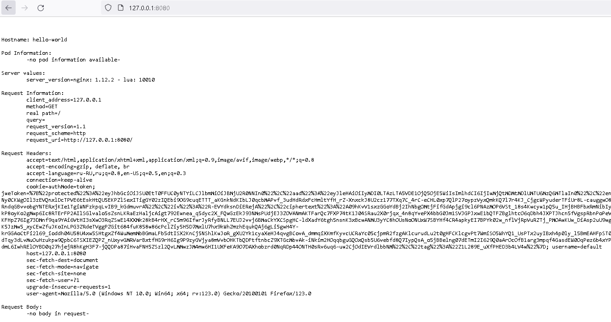
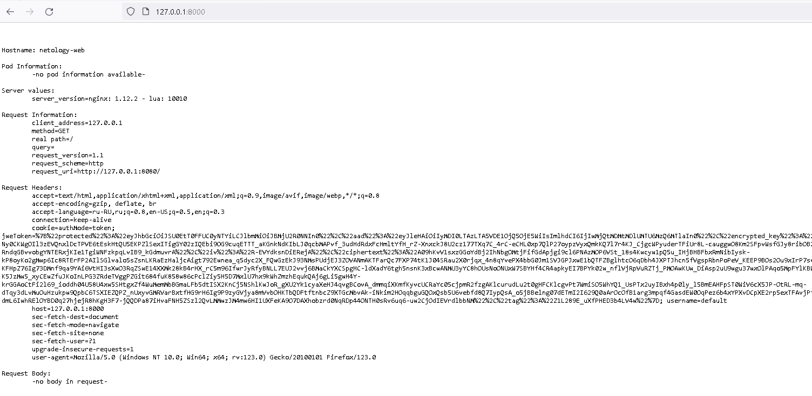

# Домашнее задание к занятию «Базовые объекты K8S»

### Цель задания

В тестовой среде для работы с Kubernetes, установленной в предыдущем ДЗ, необходимо развернуть Pod с приложением и подключиться к нему со своего локального компьютера. 

------

### Задание 1. Создать Pod с именем hello-world

1. Создать манифест (yaml-конфигурацию) Pod.

2. Использовать image - gcr.io/kubernetes-e2e-test-images/echoserver:2.2.
3. Подключиться локально к Pod с помощью `kubectl port-forward` и вывести значение (curl или в браузере).

------

### Задание 2. Создать Service и подключить его к Pod

1. Создать Pod с именем netology-web.
2. Использовать image — gcr.io/kubernetes-e2e-test-images/echoserver:2.2.
3. Создать Service с именем netology-svc и подключить к netology-web.
4. Подключиться локально к Service с помощью `kubectl port-forward` и вывести значение (curl или в браузере).

------

### Решение:

Для создания pod и service создан один манифест. Все ресурсы будут резмещаться в отдельном namespace, потому что разворачивать в ns default плохая практика.
[Netology-Manifest.yaml](./files/netology-manifest.yaml)
```
root@sdpc-lab:~# cat netology-manifest.yaml
apiVersion: v1
kind: Namespace
metadata:
  name: netology

---

apiVersion: v1
kind: Pod
metadata:
  name: hello-world
  labels:
    app: hello-world
  namespace: netology
spec:
  containers:
  - name: echoserver
    image: gcr.io/kubernetes-e2e-test-images/echoserver:2.2

---

apiVersion: v1
kind: Pod
metadata:
  name: netology-web
  labels:
    app: netology-web
  namespace: netology
spec:
  containers:
  - name: echoserver
    image: gcr.io/kubernetes-e2e-test-images/echoserver:2.2

---

apiVersion: v1
kind: Service
metadata:
  name: netology-svc
  namespace: netology
spec:
  selector:
    app: netology-web
  ports:
    - protocol: TCP
      port: 80
      targetPort: 8080

```


Созадем ресурсы, проверяем работу.
```
root@sdpc-lab:~# kubectl apply -f netology-manifest.yaml
namespace/netology created
pod/hello-world created
pod/netology-web created
service/netology-svc created

root@sdpc-lab:~# kubectl -n netology get pod
NAME           READY   STATUS    RESTARTS   AGE
netology-web   1/1     Running   0          38s
hello-world    1/1     Running   0          38s

root@sdpc-lab:~# kubectl -n netology get svc
NAME           TYPE        CLUSTER-IP       EXTERNAL-IP   PORT(S)   AGE
netology-svc   ClusterIP   10.152.183.221   <none>        80/TCP    40s
```
Подключаемся c помощью port-forward к pod с моего ПК
```
/drives/c/kube:~./kubectl.exe --kubeconfig=./kubeconfig port-forward -n netology pod/hello-world 8080:8080
Forwarding from 127.0.0.1:8080 -> 8080
Forwarding from [::1]:8080 -> 8080
Handling connection for 8080
Handling connection for 8080
```


Подключаемся c помощью port-forward к service с моего ПК
```
/drives/c/kube  ./kubectl.exe --kubeconfig=./kubeconfig port-forward -n netology service/netology-svc 8000:80
Forwarding from 127.0.0.1:8000 -> 8080
Forwarding from [::1]:8000 -> 8080
Handling connection for 8000
```


