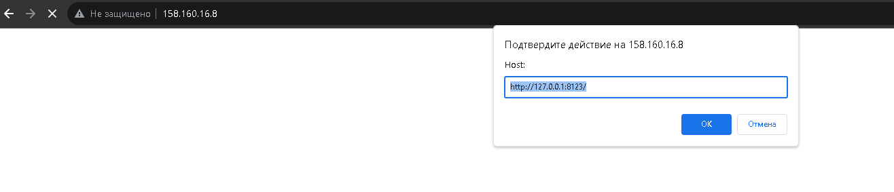

# Домашнее задание к занятию 3 «Использование Ansible»

## Основная часть

1. Допишите playbook: нужно сделать ещё один play, который устанавливает и настраивает LightHouse.
2. При создании tasks рекомендую использовать модули: `get_url`, `template`, `yum`, `apt`.
3. Tasks должны: скачать статику LightHouse, установить Nginx или любой другой веб-сервер, настроить его конфиг для открытия LightHouse, запустить веб-сервер.
4. Подготовьте свой inventory-файл `prod.yml`.
	
	Подготовил.
5. Запустите `ansible-lint site.yml` и исправьте ошибки, если они есть.

До:
```user1@t450s:~/devops-netology/mnt-homeworks/08-ansible-03-yandex/playbook$ ansible-lint site.yml
WARNING  Listing 3 violation(s) that are fatal
fqcn[action-core]: Use FQCN for builtin module actions (git).
site.yml:117 Use `ansible.builtin.git` or `ansible.legacy.git` instead.

fqcn[action-core]: Use FQCN for builtin module actions (template).
site.yml:123 Use `ansible.builtin.template` or `ansible.legacy.template` instead.

fqcn[action-core]: Use FQCN for builtin module actions (meta).
site.yml:130 Use `ansible.builtin.meta` or `ansible.legacy.meta` instead.

Read documentation for instructions on how to ignore specific rule violations.

                 Rule Violation Summary
 count tag               profile    rule associated tags
     3 fqcn[action-core] production formatting

Failed: 3 failure(s), 0 warning(s) on 1 files. Last profile that met the validation criteria was 'shared'. Rating: 4/5 star
A new release of ansible-lint is available: 6.18.0 → 6.22.0
```
После:
```
user1@t450s:~/devops-netology/mnt-homeworks/08-ansible-03-yandex/playbook$ ansible-lint site.yml

Passed: 0 failure(s), 0 warning(s) on 1 files. Last profile that met the validation criteria was 'production'.
A new release of ansible-lint is available: 6.18.0 → 6.22.0
```

6. Попробуйте запустить playbook на этом окружении с флагом `--check`.

	Выполнил.
7. Запустите playbook на `prod.yml` окружении с флагом `--diff`. Убедитесь, что изменения на системе произведены.

	Запустил, изменения произведены.
8. Повторно запустите playbook с флагом `--diff` и убедитесь, что playbook идемпотентен.
	
	Playbook запустил, изменения произведены. Получил рабочий сайт 
	
9. Подготовьте README.md-файл по своему playbook. В нём должно быть описано: что делает playbook, какие у него есть параметры и теги.
	
	[**Playbook 08-ansible-03-yandex readme**](https://github.com/sda1891/devops-netology/tree/main/mnt-homeworks/08-ansible-03-yandex/playbook/README.md)

10. Готовый playbook выложите в свой репозиторий, поставьте тег `08-ansible-03-yandex` на фиксирующий коммит, в ответ предоставьте ссылку на него.

	[**Playbook 08-ansible-03-yandex**](https://github.com/sda1891/devops-netology/tree/main/mnt-homeworks/08-ansible-03-yandex/playbook/)
	
---

