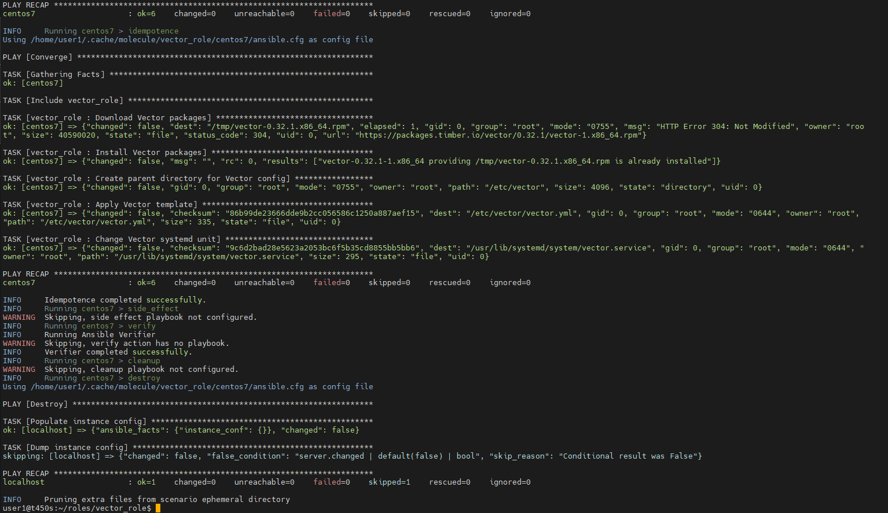

# Домашнее задание к занятию 5 «Тестирование roles»

### Molecule

1. Запустите  `molecule test -s centos_7` внутри корневой директории clickhouse-role, посмотрите на вывод команды. Данная команда может отработать с ошибками, это нормально. Наша цель - посмотреть как другие в реальном мире используют молекулу.

	Сделано. Тесты запустились только с molecule 3.5.2. После установки molecule 6.0.2 тестирование свалилось с ошибками.

2. Перейдите в каталог с ролью vector-role и создайте сценарий тестирования по умолчанию при помощи `molecule init scenario --driver-name docker`.

	Сделано.

3. Добавьте несколько разных дистрибутивов (centos:8, ubuntu:latest) для инстансов и протестируйте роль, исправьте найденные ошибки, если они есть.

	Сделаны сценарии для centos 7 и 8

4. Добавьте несколько assert в verify.yml-файл для  проверки работоспособности vector-role (проверка, что конфиг валидный, проверка успешности запуска и др.). 

	Сделано.

5. Запустите тестирование роли повторно и проверьте, что оно прошло успешно.

	Тестирование centos7 
	
	Тестирование centos8 
	

5. Добавьте новый тег на коммит с рабочим сценарием в соответствии с семантическим версионированием.

	[Vector Role Tag:1.0.4](https://github.com/sda1891/vector_role/tree/1.0.4)


### Tox

1. Добавьте в директорию с vector-role файлы из [директории](./example).
2. Запустите `docker run --privileged=True -v <path_to_repo>:/opt/vector-role -w /opt/vector-role -it aragast/netology:latest /bin/bash`, где path_to_repo — путь до корня репозитория с vector-role на вашей файловой системе.
3. Внутри контейнера выполните команду `tox`, посмотрите на вывод.

	

5. Создайте облегчённый сценарий для `molecule` с драйвером `molecule_podman`. Проверьте его на исполнимость.

	Запуск роли с podman 

6. Пропишите правильную команду в `tox.ini`, чтобы запускался облегчённый сценарий.

	```
	commands =
    {posargs:molecule test -s podman-cl8 --destroy always}
	```

8. Запустите команду `tox`. Убедитесь, что всё отработало успешно.

	

9. Добавьте новый тег на коммит с рабочим сценарием в соответствии с семантическим версионированием.

  [Tox scenario commit, Tag:1.0.5](https://github.com/sda1891/vector_role/tree/1.0.5)

После выполнения у вас должно получится два сценария molecule и один tox.ini файл в репозитории. Не забудьте указать в ответе теги решений Tox и Molecule заданий. В качестве решения пришлите ссылку на  ваш репозиторий и скриншоты этапов выполнения задания. 


---

