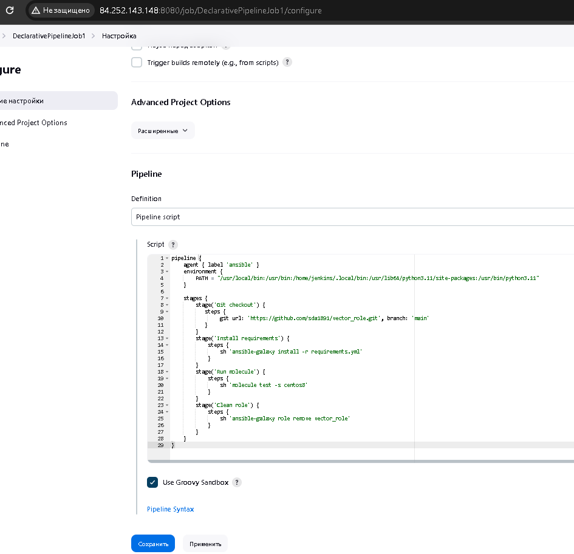
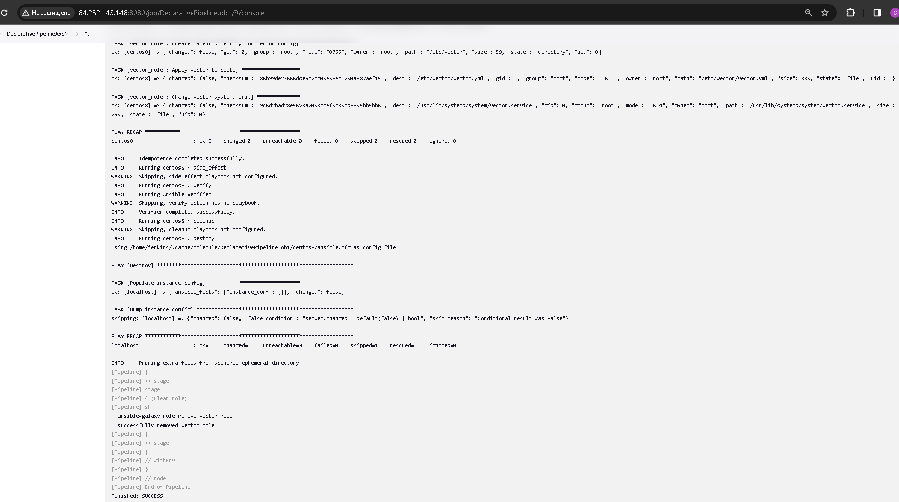
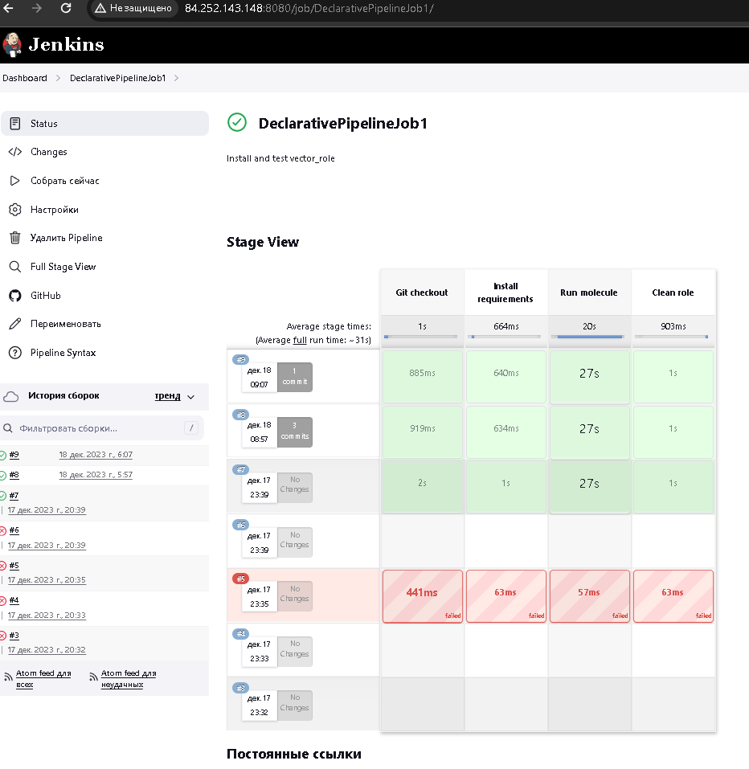
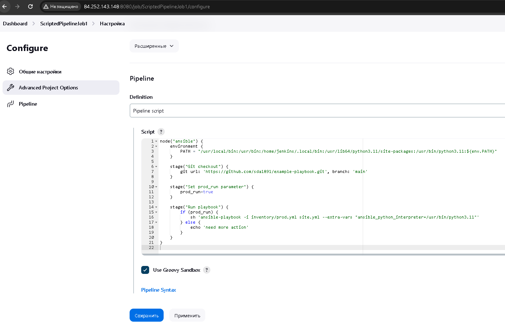

# Домашнее задание к занятию 10 «Jenkins»

## Основная часть

1. Сделать Freestyle Job, который будет запускать `molecule test` из любого вашего репозитория с ролью.

  

    

2. Сделать Declarative Pipeline Job, который будет запускать `molecule test` из любого вашего репозитория с ролью.
   
   
   
   
   
   
  
3. Перенести Declarative Pipeline в репозиторий в файл `Jenkinsfile`.

    [**Jenkinsfile**](https://raw.githubusercontent.com/sda1891/vector_role/main/Jenkinsfile)

4. Создать Multibranch Pipeline на запуск `Jenkinsfile` из репозитория.

   
   
   
   
   
   
   

5. Создать Scripted Pipeline, наполнить его скриптом из [pipeline](./pipeline).
6. Внести необходимые изменения, чтобы Pipeline запускал `ansible-playbook` без флагов `--check --diff`, если не установлен параметр при запуске джобы (prod_run = True). По умолчанию параметр имеет значение False и запускает прогон с флагами `--check --diff`.

   

   
   
   

7. Проверить работоспособность, исправить ошибки, исправленный Pipeline вложить в репозиторий в файл `ScriptedJenkinsfile`.
  
   [**ScriptedJenkinsfile**](https://raw.githubusercontent.com/sda1891/vector_role/main/ScriptedJenkinsfile)
   
   

8. Отправить ссылку на репозиторий с ролью и Declarative Pipeline и Scripted Pipeline.

   [GitHub Role Link](https://github.com/sda1891/vector_role/tree/main)

---
