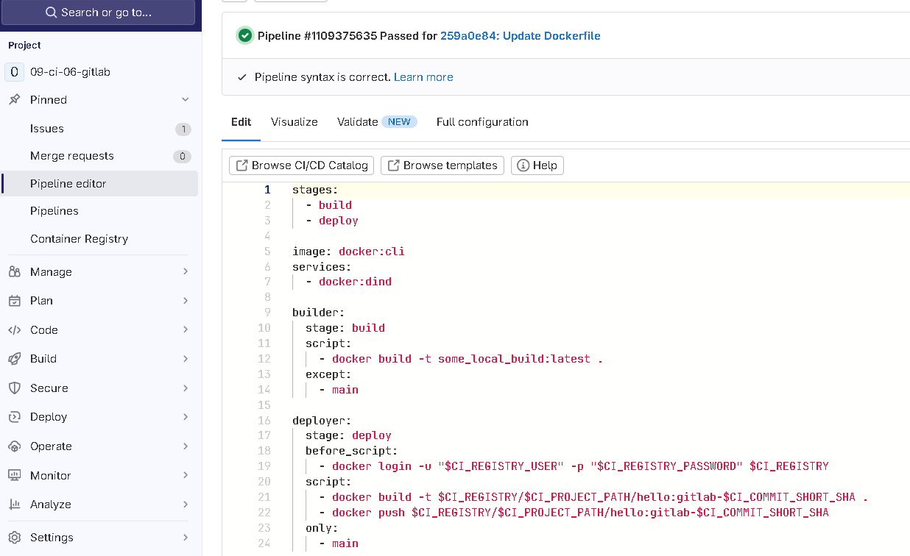
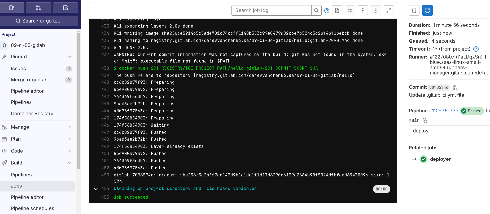
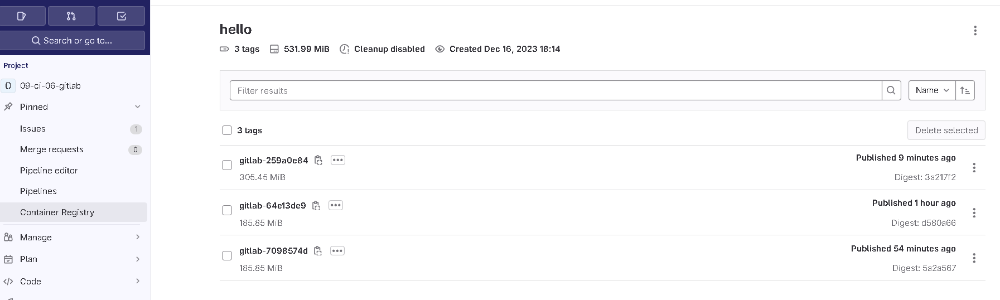
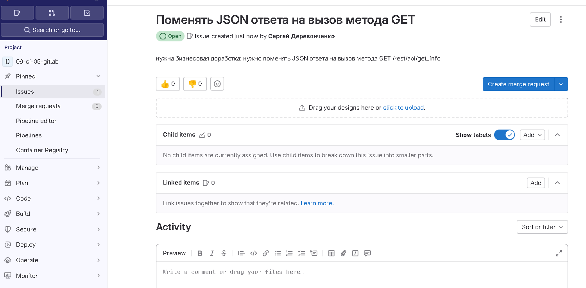
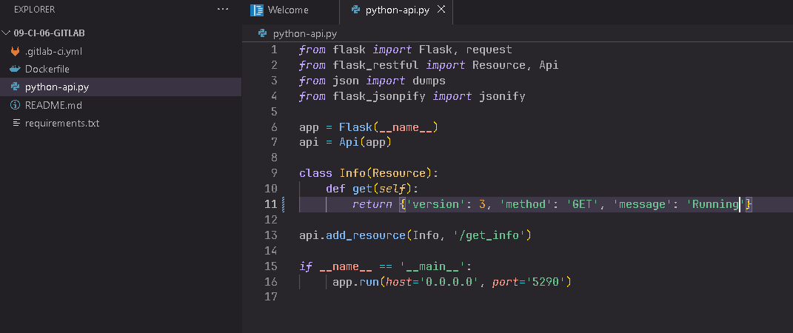
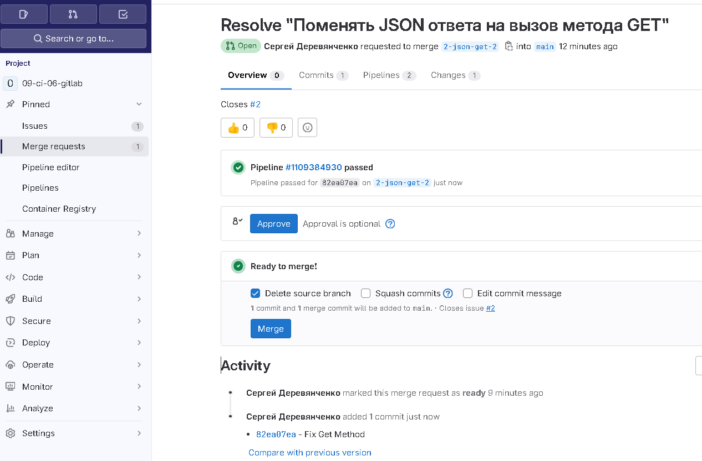
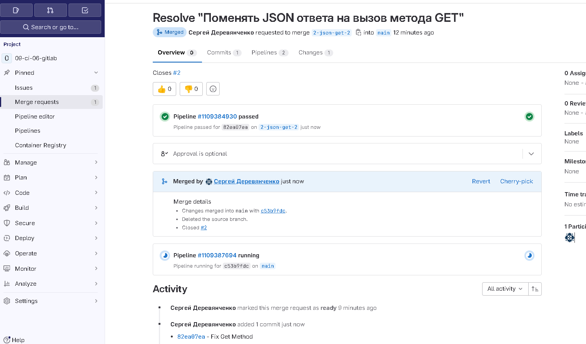
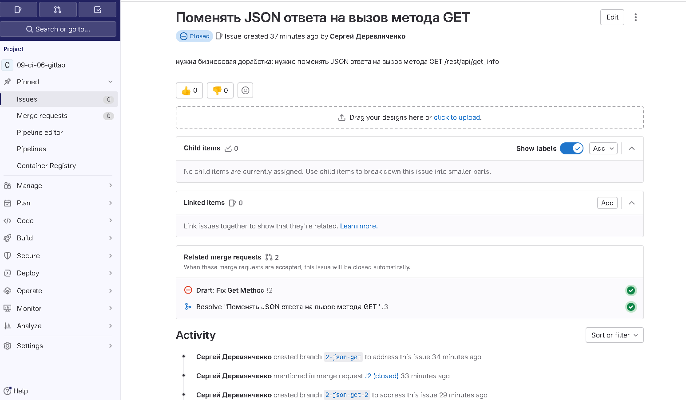

# Домашнее задание к занятию 12 «GitLab»

### DevOps

В репозитории содержится код проекта на Python. Проект — RESTful API сервис. Ваша задача — автоматизировать сборку образа с выполнением python-скрипта:

1. Образ собирается на основе [centos:7](https://hub.docker.com/_/centos?tab=tags&page=1&ordering=last_updated).
2. Python версии не ниже 3.7.
3. Установлены зависимости: `flask` `flask-jsonpify` `flask-restful`.
4. Создана директория `/python_api`.
5. Скрипт из репозитория размещён в /python_api.
6. Точка вызова: запуск скрипта.
7. При комите в любую ветку должен собираться docker image с форматом имени hello:gitlab-$CI_COMMIT_SHORT_SHA . Образ должен быть выложен в Gitlab registry или yandex registry.   
 
 **Pipeline**
  
  
  **Build complete**  
  
  
  **Uploaded images**  
  

### Product Owner

Вашему проекту нужна бизнесовая доработка: нужно поменять JSON ответа на вызов метода GET `/rest/api/get_info`, необходимо создать Issue в котором указать:

1. Какой метод необходимо исправить.
2. Текст с `{ "message": "Already started" }` на `{ "message": "Running"}`.
3. Issue поставить label: feature.

### Developer

Пришёл новый Issue на доработку, вам нужно:

1. Создать отдельную ветку, связанную с этим Issue.

	
	
	

2. Внести изменения по тексту из задания.

   
   
3. Подготовить Merge Request, влить необходимые изменения в `master`, проверить, что сборка прошла успешно.

  **Ready to merge**
  
  
  **Merged**
  
  
  **Issue closed**
  


### Tester

Разработчики выполнили новый Issue, необходимо проверить валидность изменений:

1. Поднять докер-контейнер с образом `python-api:latest` и проверить возврат метода на корректность.
2. Закрыть Issue с комментарием об успешности прохождения, указав желаемый результат и фактически достигнутый.

```
root@t450s:~# docker run -d --name python_api --publish-all registry.gitlab.com/derevyanchenko.sa/09-ci-06-gitlab/hello:gitlab-c53b9fdc
1346e61fb0c5d4df8bf67daa6505746649cb7b615da43424e4f4aa71ecccb921

root@t450s:~# docker ps
CONTAINER ID   IMAGE                                                                         COMMAND                  CREATED         STATUS         PORTS     NAMES
1346e61fb0c5   registry.gitlab.com/derevyanchenko.sa/09-ci-06-gitlab/hello:gitlab-c53b9fdc   "python3 /python_api…"   3 seconds ago   Up 2 seconds             python_api

root@t450s:~# docker exec -it python_api bash

[root@1346e61fb0c5 /]# curl -v http://172.17.0.2:5290/get_info
* About to connect() to 172.17.0.2 port 5290 (#0)
*   Trying 172.17.0.2...
* Connected to 172.17.0.2 (172.17.0.2) port 5290 (#0)
> GET /get_info HTTP/1.1
> User-Agent: curl/7.29.0
> Host: 172.17.0.2:5290
> Accept: */*
>
* HTTP 1.0, assume close after body
< HTTP/1.0 200 OK
< Content-Type: application/json
< Content-Length: 54
< Server: Werkzeug/2.0.3 Python/3.6.8
< Date: Sat, 16 Dec 2023 20:23:50 GMT
<
{"version": 3, "method": "GET", "message": "Running"}
* Closing connection 0


```  

## Итог

В качестве ответа пришлите подробные скриншоты по каждому пункту задания:

- файл gitlab-ci.yml;

  [.gitlab-ci.yml](./files/gitlab-ci.yml)

- Dockerfile; 
 
  [Dickerfile](./files/Dockerfile)
   
- лог успешного выполнения пайплайна;

  [Build log](./files/build.log)

- решённый Issue.

  [Issue](https://gitlab.com/derevyanchenko.sa/09-ci-06-gitlab/-/issues/2)


