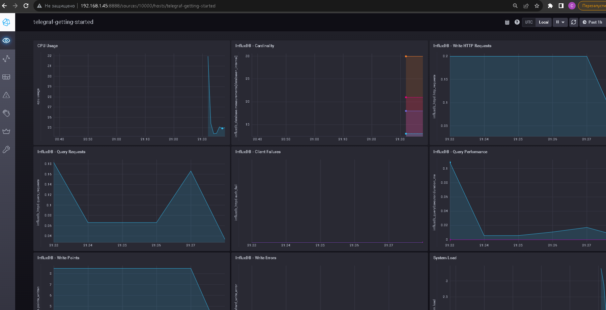
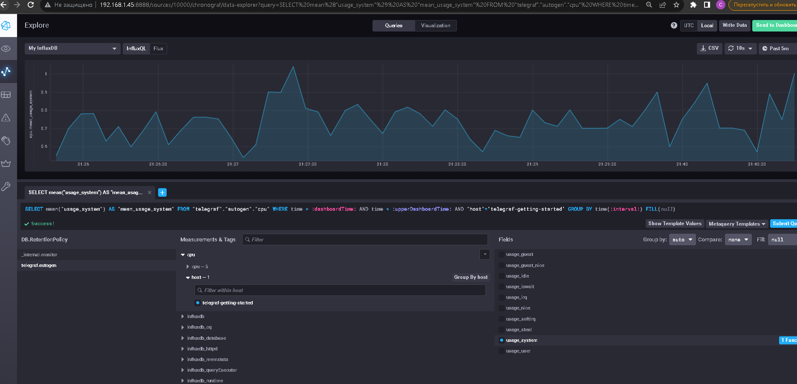
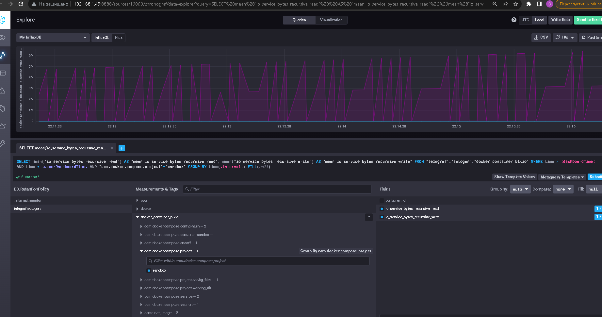

# Домашнее задание к занятию "13.Системы мониторинга"

## Обязательные задания

1. Вас пригласили настроить мониторинг на проект. На онбординге вам рассказали, что проект представляет из себя платформу для вычислений с выдачей текстовых отчётов, которые сохраняются на диск. 
Взаимодействие с платформой осуществляется по протоколу http. Также вам отметили, что вычисления загружают ЦПУ. Какой минимальный набор метрик вы выведите в мониторинг и почему?

	- Загрузка ЦП, т.к. платформа вычислительная и ожидается нагрузка в первую очередь на ЦП
	- Утилизация ОЗУ, т.к. генерация соединений и поддержка сессий может испольвать много памяти
    - Свободное пространство на файловой системе и inodes, выдача текстовых отчетов может порождать врмеенные файлы, или может создаваться большое количество логов при нагрзуке, или дампов процессов при крашах и т.п. Если не хватит места или inodes будет глупо потерять сервер.
	- Время отклика дисковой системы, часто медленный отклик диска может провоцировать высокие значения нагрузки на ЦП, из-за ожидания процессом чтения или записи данных
	- Время ответов на http запросы, процент успешных или учет всех статусов ответов, для возможного расчета SLO
	
	
2. Менеджер продукта, посмотрев на ваши метрики, сказал, что ему непонятно, что такое RAM/inodes/CPUla. Также он сказал, что хочет понимать, насколько мы выполняем свои обязанности перед клиентами и какое качество обслуживания. Что вы можете ему предложить?

	- указанные метрики говорят о загрузке сервера, но их недостаточно для оценки качества
	- для оценки качества необходимо догвориться об уровне SLA, ввести бизнес метрики, как минимум здесь поможет учет количества успешных/неуспешных ответов и время отклика

3. Вашей DevOps-команде в этом году не выделили финансирование на построение системы сбора логов. Разработчики, в свою очередь, хотят видеть все ошибки, которые выдают их приложения. Какое решение вы можете предпринять в этой ситуации, чтобы разработчики получали ошибки приложения?

	- Возможно использование бесплатных инструментов для сбора логов, таких как ELK Stack (Elasticsearch, Logstash, Kibana) или Graylog.
	- Внедрение инструментов логирования в код приложения для записи ошибок и предупреждений.
	- Организация централизованного хранилища логов для доступа разработчиков к примеру с помощью Vector
	
	Правда во всех этих случаях может понадобится довольно богатая конфигурация аппаратной части, на которую в теории нет денег. Даже просто хранить логи где-то надо. Любая система сбора и консолидации логов довольно прожорлива к ресурсам.
		

3. Вы, как опытный SRE, сделали мониторинг, куда вывели отображения выполнения SLA = 99% по http-кодам ответов. 
Этот параметр вычисляется по формуле: summ_2xx_requests/summ_all_requests. Он не поднимается выше 70%, но при этом в вашей системе нет кодов ответа 5xx и 4xx. Где у вас ошибка?

	Я бы добавил в флормулу коды ответа 1хх и 2хх, тогда будет более объективный результат.
	
#
5. Опишите основные плюсы и минусы pull и push систем мониторинга.

   ##### Плюсы push-модели:
   - упрощение репликации данных в разные системы мониторинга или их резервные копии
   - более гибкая настройка отправки пакетов данных с метриками
   - UDP — это менее затратный способ передачи данных, из-за чего может возрасти производительность сбора метрик
	
   ##### Минусы push-модели:
   - агенты передают данные в режиме реального времени, возможна паразитная нагрузка на сервер
   - требуется настройки агентов на серверах, дополнительные плагины для приложений 
   - возможна угроза безопасности, например передача пароля в открытом виде или т.п.

   ##### Плюсы pull-модели:
   - легче контролировать подлинность данных
   - можно настроить единый proxy server до всех агентов с TLS
   - упрощённая отладка получения данных с агентов
	
   ##### Минусы pull-модели:
   - Задержка при запросе информации, т.к. идет опрос хостов
   - pull системы можут порождать большуя нагрузка на сеть при множестве одновремнных запросов
   - Из-за возникающих задержек при опросе, возможно будет сложно реализовать мониторинг в режиме реального времени
	

#
6. Какие из ниже перечисленных систем относятся к push модели, а какие к pull? А может есть гибридные?

    - Prometheus		- Pull
    - TICK				- Push
    - Zabbix			- Pull/Push
    - VictoriaMetrics	- Pull/Push
    - Nagios			- Pull
#
7. Склонируйте себе [репозиторий](https://github.com/influxdata/sandbox/tree/master) и запустите TICK-стэк, 
используя технологии docker и docker-compose.

В виде решения на это упражнение приведите скриншот веб-интерфейса ПО chronograf (`http://localhost:8888`). 
```
root@t450s:~/sandbox# docker ps
CONTAINER ID   IMAGE                   COMMAND                  CREATED          STATUS          PORTS                                                                                                                             NAMES
d7e4caf6aa7e   chrono_config           "/entrypoint.sh chro…"   15 seconds ago   Up 13 seconds   0.0.0.0:8888->8888/tcp, :::8888->8888/tcp                                                                                         sandbox_chronograf_1
e2199501299a   telegraf                "/entrypoint.sh tele…"   16 seconds ago   Up 14 seconds   8092/udp, 8125/udp, 8094/tcp                                                                                                      sandbox_telegraf_1
f468ab5c97f5   kapacitor               "/entrypoint.sh kapa…"   16 seconds ago   Up 14 seconds   0.0.0.0:9092->9092/tcp, :::9092->9092/tcp                                                                                         sandbox_kapacitor_1
c7d97ce140c5   sandbox_documentation   "/documentation/docu…"   16 seconds ago   Up 15 seconds   0.0.0.0:3010->3000/tcp, :::3010->3000/tcp                                                                                         sandbox_documentation_1
2829893f83f8   influxdb                "/entrypoint.sh infl…"   16 seconds ago   Up 15 seconds   0.0.0.0:8082->8082/tcp, :::8082->8082/tcp, 0.0.0.0:8086->8086/tcp, :::8086->8086/tcp, 0.0.0.0:8089->8089/udp, :::8089->8089/udp   sandbox_influxdb_1

```
	


P.S.: если при запуске некоторые контейнеры будут падать с ошибкой - проставьте им режим `Z`, например
`./data:/var/lib:Z`

  

#
8. Перейдите в веб-интерфейс Chronograf (http://localhost:8888) и откройте вкладку Data explorer.
        
    - Нажмите на кнопку Add a query
    - Изучите вывод интерфейса и выберите БД telegraf.autogen
    - В `measurments` выберите cpu->host->telegraf-getting-started, а в `fields` выберите usage_system. Внизу появится график утилизации cpu.
    - Вверху вы можете увидеть запрос, аналогичный SQL-синтаксису. Поэкспериментируйте с запросом, попробуйте изменить группировку и интервал наблюдений.

Для выполнения задания приведите скриншот с отображением метрик утилизации cpu из веб-интерфейса.

  
 

#
9. Изучите список [telegraf inputs](https://github.com/influxdata/telegraf/tree/master/plugins/inputs). 
Добавьте в конфигурацию telegraf следующий плагин - [docker](https://github.com/influxdata/telegraf/tree/master/plugins/inputs/docker):
```
[[inputs.docker]]
  endpoint = "unix:///var/run/docker.sock"
```

Дополнительно вам может потребоваться донастройка контейнера telegraf в `docker-compose.yml` дополнительного volume и 
режима privileged:
```
  telegraf:
    image: telegraf:1.4.0
    privileged: true
    volumes:
      - ./etc/telegraf.conf:/etc/telegraf/telegraf.conf:Z
      - /var/run/docker.sock:/var/run/docker.sock:Z
    links:
      - influxdb
    ports:
      - "8092:8092/udp"
      - "8094:8094"
      - "8125:8125/udp"
```

После настройке перезапустите telegraf, обновите веб интерфейс и приведите скриншотом список `measurments` в 
веб-интерфейсе базы telegraf.autogen . Там должны появиться метрики, связанные с docker.

  Возникли проблемы доступа к /var/run/docker.sock, в остальном все уже было в конфигурации sandbox

  

---

