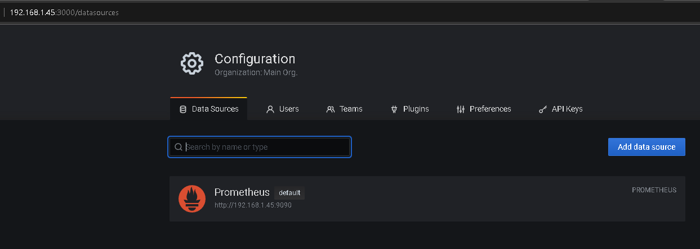
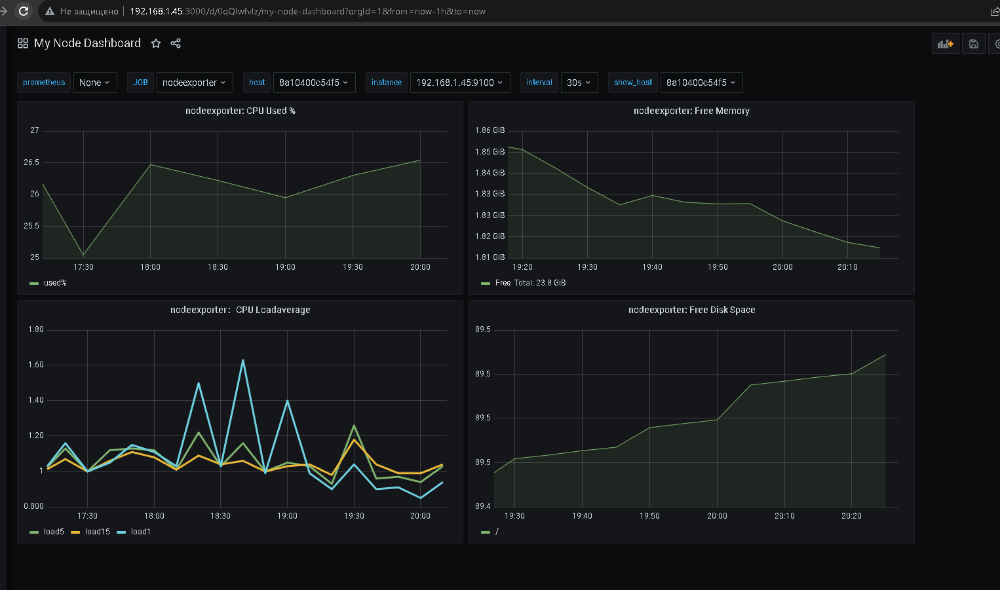
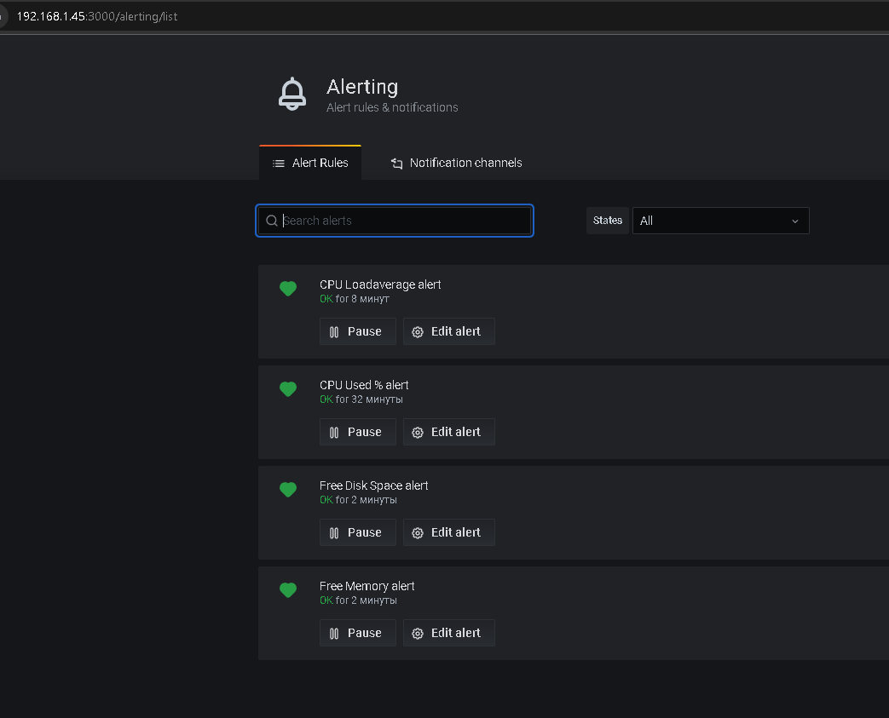
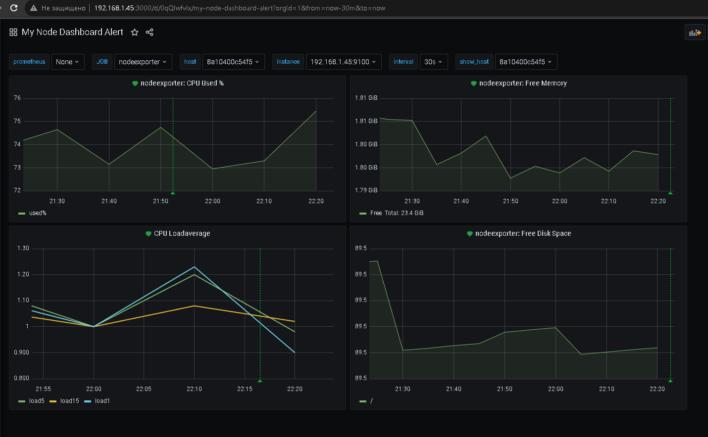

# Домашнее задание к занятию 14 «Средство визуализации Grafana»

### Задание 1

1. Используя директорию [help](./help) внутри этого домашнего задания, запустите связку prometheus-grafana.
1. Зайдите в веб-интерфейс grafana, используя авторизационные данные, указанные в манифесте docker-compose.
1. Подключите поднятый вами prometheus, как источник данных.
1. Решение домашнего задания — скриншот веб-интерфейса grafana со списком подключенных Datasource.

  


## Задание 2

Изучите самостоятельно ресурсы:

1. [PromQL tutorial for beginners and humans](https://valyala.medium.com/promql-tutorial-for-beginners-9ab455142085).
1. [Understanding Machine CPU usage](https://www.robustperception.io/understanding-machine-cpu-usage).
1. [Introduction to PromQL, the Prometheus query language](https://grafana.com/blog/2020/02/04/introduction-to-promql-the-prometheus-query-language/).

Создайте Dashboard и в ней создайте Panels:

- утилизация CPU для nodeexporter (в процентах, 100-idle);
```
avg(1 - avg(rate(node_cpu_seconds_total
		{prometheus=~"$prometheus",job=~"$job",mode="idle"}
[$interval])) by (instance)) * 100
```
- CPULA 1/5/15;
```
sum(node_load5{prometheus=~"$prometheus",job=~"$job"})

sum(node_load15{prometheus=~"$prometheus",job=~"$job"})

sum(node_load1{prometheus=~"$prometheus",job=~"$job"})
```
- количество свободной оперативной памяти;
```
sum(node_memory_MemFree_bytes{prometheus=~"$prometheus",job=~"$job"})  
```
- количество места на файловой системе.
```
100 - (node_filesystem_free_bytes
	{instance=~'$node', fstype=~"ext.*|xfs", mountpoint="/"} * 100 / 
node_filesystem_size_bytes
{instance=~'$node', fstype=~"ext.*|xfs", mountpoint="/"})
```

Для решения этого задания приведите promql-запросы для выдачи этих метрик, а также скриншот получившейся Dashboard.

  

## Задание 3

1. Создайте для каждой Dashboard подходящее правило alert — можно обратиться к первой лекции в блоке «Мониторинг».
1. В качестве решения задания приведите скриншот вашей итоговой Dashboard.

	Возникла неожиданная проблема, Grafana не повзоляет создавать алерты при использовании шаблонов.
	Ошибка "Template variables are not supported in alert queries"
	Ресурсы в интернете предлагают костыльный вариант дублирования дашбордов с абсолютными значениями.
	Например  [**template-variables-are-not-supported-in-alert-queries-while-setting-up-alert**](https://community.grafana.com/t/template-variables-are-not-supported-in-alert-queries-while-setting-up-alert/2514)
    Для выполнения ДЗ я конечно сделал всё, но в проде с многими серверами сомнительное решение.

   
  
   
 

## Задание 4

1. Сохраните ваш Dashboard.Для этого перейдите в настройки Dashboard, выберите в боковом меню «JSON MODEL». Далее скопируйте отображаемое json-содержимое в отдельный файл и сохраните его.
1. В качестве решения задания приведите листинг этого файла.

   [**Dashboard file**](./my-dashboard.json)
   
   [**Dashboard-alerts file**](./my-dashboard-alerts.json)

---
