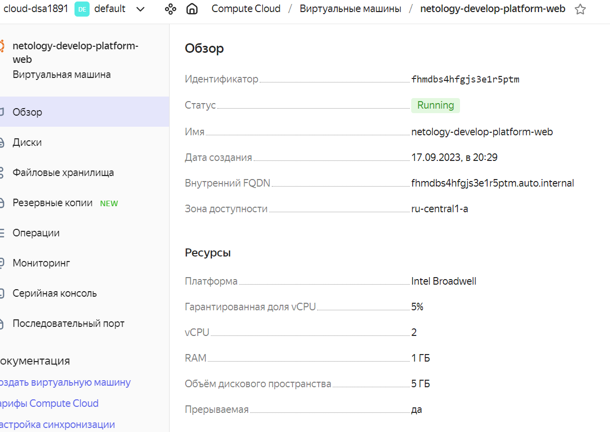

# Домашнее задание к занятию «Основы Terraform. Yandex Cloud»

### Задание 1
В качестве ответа всегда полностью прикладывайте ваш terraform-код в git.

1. Изучите проект. В файле variables.tf объявлены переменные для Yandex provider.
2. Переименуйте файл personal.auto.tfvars_example в personal.auto.tfvars. Заполните переменные: идентификаторы облака, токен доступа. Благодаря .gitignore этот файл не попадёт в публичный репозиторий. **Вы можете выбрать иной способ безопасно передать секретные данные в terraform.**
3. Сгенерируйте или используйте свой текущий ssh-ключ. Запишите его открытую часть в переменную **vms_ssh_root_key**.

	Сделано.
	
4. Инициализируйте проект, выполните код. Исправьте намеренно допущенные синтаксические ошибки. Ищите внимательно, посимвольно. Ответьте, в чём заключается их суть.

	- Ошибка была в определении platform_id, возможный правильный вариант "standard-v1"(v2 или v3), правильные названия можно было найти на портале. И я не сразу увидел standar**t** и вспомнил фокус с resulT.
	- Также возникла ошибка с количеством ядер, допустимые значения были 2 или 4, а в конфиге стояла 1.
	
	
5. Ответьте, как в процессе обучения могут пригодиться параметры ```preemptible = true``` и ```core_fraction=5``` в параметрах ВМ. Ответ в документации Yandex Cloud.

В качестве решения приложите:

- скриншот ЛК Yandex Cloud с созданной ВМ;


```
root@t450s:/home/user1/devops-netology/ter-homeworks/02/src# yc compute instance list
+----------------------+-------------------------------+---------------+---------+----------------+-------------+
|          ID          |             NAME              |    ZONE ID    | STATUS  |  EXTERNAL IP   | INTERNAL IP |
+----------------------+-------------------------------+---------------+---------+----------------+-------------+
| fhmdbs4hfgjs3e1r5ptm | netology-develop-platform-web | ru-central1-a | RUNNING | 158.160.46.138 | 10.0.1.27   |
+----------------------+-------------------------------+---------------+---------+----------------+-------------+

```
- скриншот успешного подключения к консоли ВМ через ssh. К OS ubuntu необходимо подключаться под пользователем ubuntu: "ssh ubuntu@vm_ip_address";

```
root@t450s:/home/user1/devops-netology/ter-homeworks/02/src# ssh -i ~/.ssh/id_ed25519 ubuntu@158.160.46.138
The authenticity of host '158.160.46.138 (158.160.46.138)' can't be established.
ED25519 key fingerprint is SHA256:Dtl0dSi/s1d3yKZcgQy3mUfqWnmcDKEDM18Sej5DWJQ.
This key is not known by any other names
Are you sure you want to continue connecting (yes/no/[fingerprint])? yes
Warning: Permanently added '158.160.46.138' (ED25519) to the list of known hosts.
---cut---

ubuntu@fhmdbs4hfgjs3e1r5ptm:~$ uname -a
Linux fhmdbs4hfgjs3e1r5ptm 5.4.0-162-generic #179-Ubuntu SMP Mon Aug 14 08:51:31 UTC 2023 x86_64 x86_64 x86_64 GNU/Linux
ubuntu@fhmdbs4hfgjs3e1r5ptm:~$ uptime
 17:34:23 up 3 min,  1 user,  load average: 0.12, 0.20, 0.10

```
- ответы на вопросы.
	- ```preemptible``` может быть полезным, когда не критично чтобы инстанс работал непрерывно и возможно прерывание его работы в обмен на более низкую стоимость использования ресурсов.
	- ```coreFraction``` устанавливает базовый уровень производительности для каждого ядра ЦП представленый в процентах. Если устанавливить coreFraction=5, инстанс будет иметь базовый уровень производительности на уровне 5% для каждого ядра ЦП.
Допустимые значения: 0, 5, 20, 50 или 100. Эти значения представляют проценты и определяют базовый уровень производительности.
Оба параметра помогут мне экономить студентческий грант, так как я буду меньше платить за использование ресурсов. 

### Задание 2

1. Изучите файлы проекта.
2. Замените все хардкод-**значения** для ресурсов **yandex_compute_image** и **yandex_compute_instance** на **отдельные** переменные. К названиям переменных ВМ добавьте в начало префикс **vm_web_** .  Пример: **vm_web_name**.
2. Объявите нужные переменные в файле variables.tf, обязательно указывайте тип переменной. Заполните их **default** прежними значениями из main.tf. 
3. Проверьте terraform plan. Изменений быть не должно. 
```
root@t450s:/home/user1/devops-netology/ter-homeworks/02/src# terraform plan
data.yandex_compute_image.ubuntu: Reading...
yandex_vpc_network.develop: Refreshing state... [id=enpimggemfl12lckqb9j]
data.yandex_compute_image.ubuntu: Read complete after 0s [id=fd8d8etig5vu92nh75bm]
yandex_vpc_subnet.develop: Refreshing state... [id=e9bg8l9f6hv57scj753h]
yandex_compute_instance.platform: Refreshing state... [id=fhmdbs4hfgjs3e1r5ptm]

Terraform used the selected providers to generate the following execution plan. Resource actions are indicated with the following
symbols:
  ~ update in-place

Terraform will perform the following actions:

  # yandex_compute_instance.platform will be updated in-place
  ~ resource "yandex_compute_instance" "platform" {
        id                        = "fhmdbs4hfgjs3e1r5ptm"
        name                      = "netology-develop-platform-web"
        # (9 unchanged attributes hidden)

      ~ resources {
        # (4 unchanged attributes hidden)
        }

        # (5 unchanged blocks hidden)
    }

Plan: 0 to add, 1 to change, 0 to destroy.

────────────────────────────────────────────────────────────────────────────────────────────────────────────────────────────────────

Note: You didn't use the -out option to save this plan, so Terraform can't guarantee to take exactly these actions if you run
"terraform apply" now.
```

### Задание 3

1. Создайте в корне проекта файл 'vms_platform.tf' . Перенесите в него все переменные первой ВМ.
2. Скопируйте блок ресурса и создайте с его помощью вторую ВМ в файле main.tf: **"netology-develop-platform-db"** ,  cores  = 2, memory = 2, core_fraction = 20. Объявите её переменные с префиксом **vm_db_** в том же файле ('vms_platform.tf').
3. Примените изменения.

В результате развернута еще одна ВМ.

```
root@t450s:/home/user1/devops-netology/ter-homeworks/02/src# !yc
yc compute instance list
+----------------------+-------------------------------+---------------+---------+---------------+-------------+
|          ID          |             NAME              |    ZONE ID    | STATUS  |  EXTERNAL IP  | INTERNAL IP |
+----------------------+-------------------------------+---------------+---------+---------------+-------------+
| fhm9vfcj3mnglj7s9kfb | netology-develop-platform-web | ru-central1-a | RUNNING | 51.250.64.196 | 10.0.1.35   |
| fhmaomeep8tl21qg8062 | netology-develop-platform-db  | ru-central1-a | RUNNING | 51.250.13.120 | 10.0.1.24   |
+----------------------+-------------------------------+---------------+---------+---------------+-------------+
```

### Задание 4

1. Объявите в файле outputs.tf output типа map, содержащий { instance_name = external_ip } для каждой из ВМ.
2. Примените изменения.

В качестве решения приложите вывод значений ip-адресов команды ```terraform output```.

```
root@t450s:/home/user1/devops-netology/ter-homeworks/02/src# terraform output
instance_ips = {
  "db" = "51.250.13.120"
  "web" = "51.250.64.196"
}
```

### Задание 5

1. В файле locals.tf опишите в **одном** local-блоке имя каждой ВМ, используйте интерполяцию ${..} с несколькими переменными по примеру из лекции.
2. Замените переменные с именами ВМ из файла variables.tf на созданные вами local-переменные.
3. Примените изменения.

Создал local.tf и поменял name 
```
locals {
  web_instance_name = "${var.org}-${var.org-unit}-${var.comp_inst_name}-${element(var.comp_inst_type, 1)}"
  db_instance_name  = "${var.org}-${var.org-unit}-${var.comp_inst_name}-${element(var.comp_inst_type, 0)}"
}
```
Применил
```
root@t450s:/home/user1/devops-netology/ter-homeworks/02/src# terraform apply
data.yandex_compute_image.ubuntu: Reading...
yandex_vpc_network.develop: Refreshing state... [id=enpctnq1vo3gmhdhp1mc]
data.yandex_compute_image.ubuntu: Read complete after 0s [id=fd8d8etig5vu92nh75bm]
yandex_vpc_subnet.develop: Refreshing state... [id=e9bmn2srcj6gd5756lsj]
yandex_compute_instance.platform-db: Refreshing state... [id=fhmaomeep8tl21qg8062]
yandex_compute_instance.platform: Refreshing state... [id=fhm9vfcj3mnglj7s9kfb]

No changes. Your infrastructure matches the configuration.

Terraform has compared your real infrastructure against your configuration and found no differences, so no changes are needed.

Apply complete! Resources: 0 added, 0 changed, 0 destroyed.

Outputs:

instance_ips = {
  "db" = "51.250.13.120"
  "web" = "51.250.64.196"
}
```


### Задание 6

1. Вместо использования трёх переменных  ".._cores",".._memory",".._core_fraction" в блоке  resources {...}, объедините их в переменные типа **map** с именами "vm_web_resources" и "vm_db_resources". В качестве продвинутой практики попробуйте создать одну map-переменную **vms_resources** и уже внутри неё конфиги обеих ВМ — вложенный map.

Добавлена переменная типа **map**
```
variable "vms_resources" {
  type = map(object({
    cores         = number
    memory        = number
    core_fraction = number
  }))

  default = {
    web = {
      cores         = 2
      memory        = 1
      core_fraction = 5
    }
    db = {
      cores         = 2
      memory        = 2
      core_fraction = 20
    }
  }
}
```
Файл locals был изменен, с учетом появления vms_resources
```
locals {
  vm_resources = {
    web = {
      instance_name = "${var.org}-${var.org-unit}-${var.comp_inst_name}-${element(var.comp_inst_type, 1)}"
      resources      = var.vms_resources["web"]
    }
    db = {
      instance_name = "${var.org}-${var.org-unit}-${var.comp_inst_name}-${element(var.comp_inst_type, 0)}"
      resources      = var.vms_resources["db"]
    }
  }
}
```

2. Также поступите с блоком **metadata {serial-port-enable, ssh-keys}**, эта переменная должна быть общая для всех ваших ВМ.

Файл locals изменен, добавлена общая настройка в виде переменной shared_metadata
```
locals {

  shared_metadata = {
    serial-port-enable = 1
    ssh-keys           = "ubuntu:${var.vms_ssh_root_key}"
  }

  vm_resources = {
    web = {
      instance_name = "${var.org}-${var.org-unit}-${var.comp_inst_name}-${element(var.comp_inst_type, 1)}"
      resources      = var.vms_resources["web"]
      metadata       = local.shared_metadata
    }
    db = {
      instance_name = "${var.org}-${var.org-unit}-${var.comp_inst_name}-${element(var.comp_inst_type, 0)}"
      resources      = var.vms_resources["db"]
      metadata       = local.shared_metadata
    }
  }
}
```
В файле main.tf заменен блок metadata на одну строку в каждом инстансе
```metadata = local.vm_resources.web.metadata```
и
```metadata = local.vm_resources.db.metadata```

3. Найдите и удалите все более не используемые переменные проекта.
	
	Сделал

4. Проверьте terraform plan. Изменений быть не должно.
```
root@t450s:/home/user1/devops-netology/ter-homeworks/02/src# terraform plan
data.yandex_compute_image.ubuntu: Reading...
yandex_vpc_network.develop: Refreshing state... [id=enpctnq1vo3gmhdhp1mc]
data.yandex_compute_image.ubuntu: Read complete after 1s [id=fd8d8etig5vu92nh75bm]
yandex_vpc_subnet.develop: Refreshing state... [id=e9bmn2srcj6gd5756lsj]
yandex_compute_instance.platform-db: Refreshing state... [id=fhmaomeep8tl21qg8062]
yandex_compute_instance.platform: Refreshing state... [id=fhm9vfcj3mnglj7s9kfb]

No changes. Your infrastructure matches the configuration.

Terraform has compared your real infrastructure against your configuration and found no differences, so no changes are needed.
```

------

### Задание 7*

Изучите содержимое файла console.tf. Откройте terraform console, выполните следующие задания: 

1. Напишите, какой командой можно отобразить **второй** элемент списка test_list.
```
> local.test_list[1]
"staging"
```

2. Найдите длину списка test_list с помощью функции length(<имя переменной>).
```
> length(local.test_list)
3
```

3. Напишите, какой командой можно отобразить значение ключа admin из map test_map.
```
> local.test_map.admin
"John"
```
4. Напишите interpolation-выражение, результатом которого будет: "John is admin for production server based on OS ubuntu-20-04 with X vcpu, Y ram and Z virtual disks", используйте данные из переменных test_list, test_map, servers и функцию length() для подстановки значений.
```
> "${local.test_map.admin} is admin for ${local.test_list[2]} server based on OS ${local.servers.production.image} with ${local.servers.production.cpu} vcpu, ${local.servers.production.ram} ram and ${length(local.servers.production.disks)} virtual disks"
"John is admin for production server based on OS ubuntu-20-04 with 10 vcpu, 40 ram and 4 virtual disks"
```

