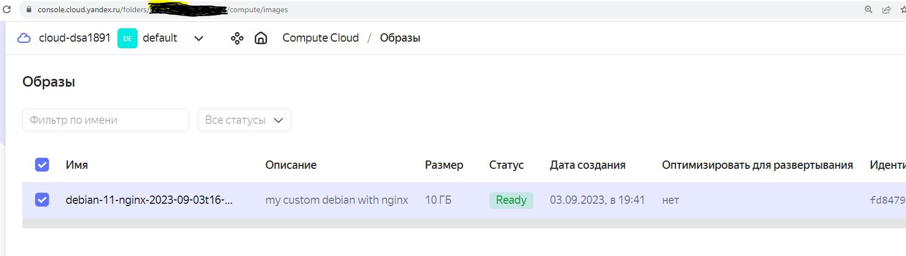
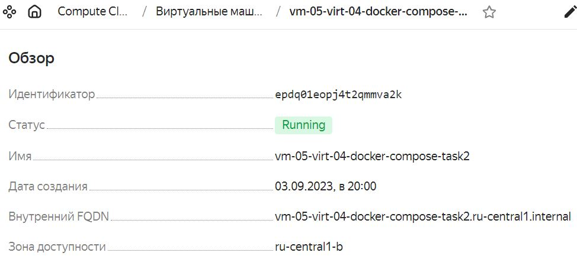
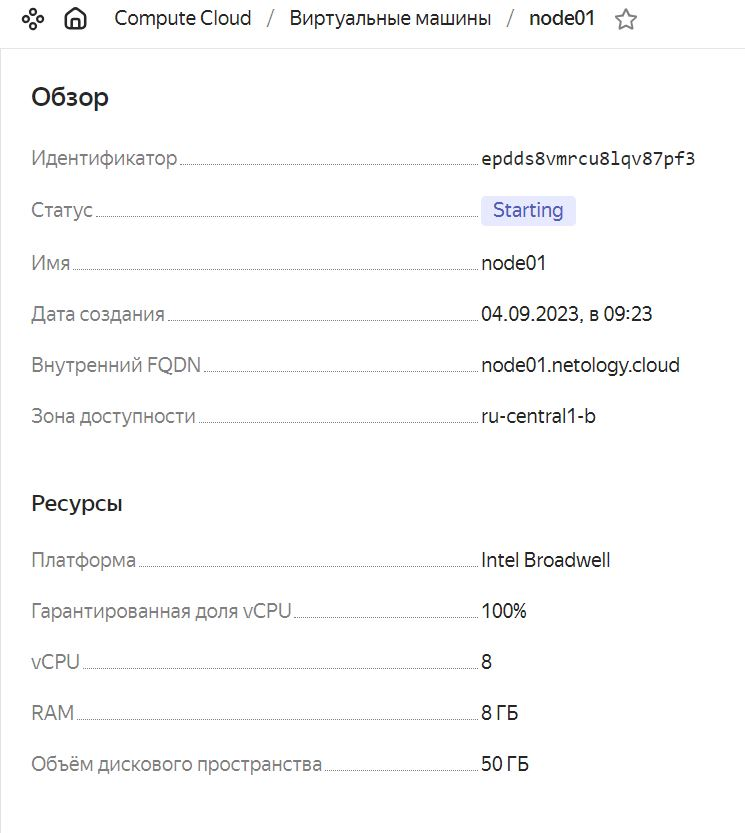
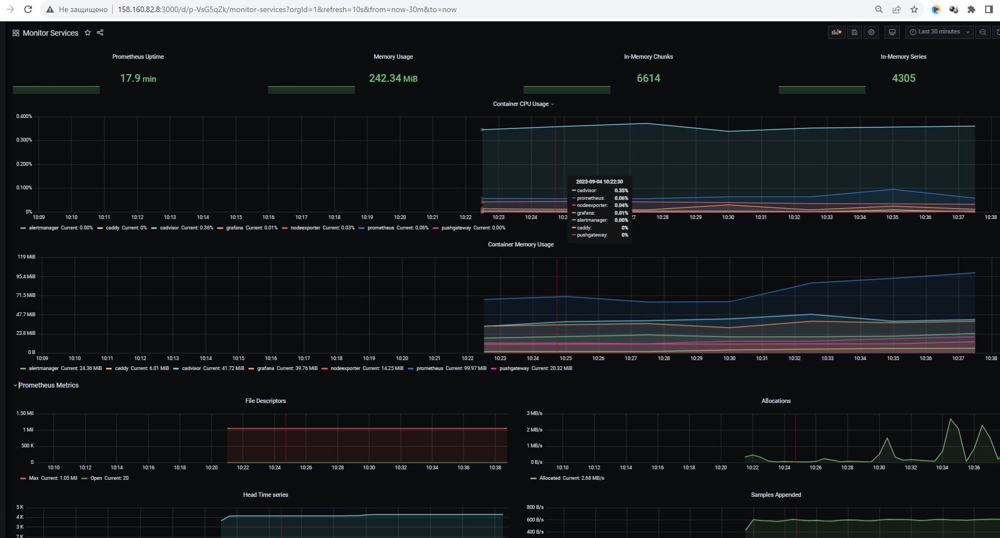

# Домашнее задание к занятию 4. «Оркестрация группой Docker-контейнеров на примере Docker Compose»

---

## Задача 1

Создайте собственный образ любой операционной системы (например ubuntu-20.04) с помощью Packer ([инструкция](https://cloud.yandex.ru/docs/tutorials/infrastructure-management/packer-quickstart)).

Чтобы получить зачёт, вам нужно предоставить скриншот страницы с созданным образом из личного кабинета YandexCloud.
```bash
root@t450s:~# packer build image.json
yandex: output will be in this color.

==> yandex: Creating temporary RSA SSH key for instance...
==> yandex: Using as source image: fd87q4jvf0vdho41nnvr (name: "debian-11-v20230828", family: "debian-11")
==> yandex: Use provided subnet id e2l5t1sbn0ac81i9cc61
==> yandex: Creating disk...
==> yandex: Creating instance...
==> yandex: Waiting for instance with id epdvc4rj53cn1rkboduk to become active...

---cut---

==> yandex: Stopping instance...
==> yandex: Deleting instance...
    yandex: Instance has been deleted!
==> yandex: Creating image: debian-11-nginx-2023-09-03t16-38-55z
==> yandex: Waiting for image to complete...
==> yandex: Success image create...
==> yandex: Destroying boot disk...
    yandex: Disk has been deleted!
Build 'yandex' finished after 3 minutes 9 seconds.
```



## Задача 2

**2.1.** Создайте вашу первую виртуальную машину в YandexCloud с помощью web-интерфейса YandexCloud.      
```bash
root@t450s:~# yc compute instance list
+----------------------+------------------------------------+---------------+---------+----------------+-------------+
|          ID          |                NAME                |    ZONE ID    | STATUS  |  EXTERNAL IP   | INTERNAL IP |
+----------------------+------------------------------------+---------------+---------+----------------+-------------+
| epdq01eopj4t2qmmva2k | vm-05-virt-04-docker-compose-task2 | ru-central1-b | RUNNING | 158.160.79.222 | 10.129.0.7  |
+----------------------+------------------------------------+---------------+---------+----------------+-------------+

```


  

**2.2.*** **(Необязательное задание)**      
Создайте вашу первую виртуальную машину в YandexCloud с помощью Terraform (вместо использования веб-интерфейса YandexCloud).
Используйте Terraform-код в директории ([src/terraform](https://github.com/netology-group/virt-homeworks/tree/virt-11/05-virt-04-docker-compose/src/terraform)).

Чтобы получить зачёт, вам нужно предоставить вывод команды terraform apply и страницы свойств, созданной ВМ из личного кабинета YandexCloud.
```bash
root@t450s:~/terraform/05-virt-04-docker-compose# terraform apply

Terraform used the selected providers to generate the following execution plan. Resource actions are indicated with the following
symbols:
  + create

Terraform will perform the following actions:

  # yandex_compute_instance.node01 will be created
  + resource "yandex_compute_instance" "node01" {
      + allow_stopping_for_update = true
      + created_at                = (known after apply)
      + folder_id                 = (known after apply)
      + fqdn                      = (known after apply)
      + gpu_cluster_id            = (known after apply)
      + hostname                  = "node01.netology.cloud"
      + id                        = (known after apply)
      + metadata                  = {
          + "ssh-keys" = <<-EOT
                centos:ssh-rsa AAAAB3NzaC1yc2EAAAADAQABAAABgQCwvof+MT42FEMJ3hjXheapLcbOFVdtTSENPTvWzy/tGTVAiF4ozofS0NAz+UAONZhqPPB+HPiGQtP1qqq1Ga0Co30cX5RFkxZyqa8HX0RsLQwTfcE7joA2gupy62owMMiCRpDpcPbsNaBdadGYm3Z6r6JBwO+HoOJNhAXj6YAl50DmjYBTlKguiAAGk8M3iXAJjS1ioHKIxIzBwK1LoX9c9/pQAnBDJgd2K60fRsm59COVIJfiuACyW4JCiY/+n1uhlzFDqFkh+5GEa89UqETWVhDngj8AaXQBpVuh8KD3PH7nSKijjUczPcvzwiwrg+SPLvTI3YmZJTqMlyTuNpmC0mXaO2e35LFpNt8sYezW0hyc9/jrGqFf6x02qN/BNA1gNCv89O90ZVpVU6lSVC5t/BnGZg/LSuSpMMUB0tQErXNW14Us8OgFZDUtMENPhDPlUikfKDHSqX7IxyDT97df/ylxjBMCpb3n0YiApvK8M3Z54acltQTf9pUSiOht2qc= root@t450s
            EOT
        }
      + name                      = "node01"
      + network_acceleration_type = "standard"
      + platform_id               = "standard-v1"
      + service_account_id        = (known after apply)
      + status                    = (known after apply)
      + zone                      = "ru-central1-b"

      + boot_disk {
          + auto_delete = true
          + device_name = (known after apply)
          + disk_id     = (known after apply)
          + mode        = (known after apply)

          + initialize_params {
              + block_size  = (known after apply)
              + description = (known after apply)
              + image_id    = "fd8iao93ujrt90jt7p0g"
              + name        = "root-node01"
              + size        = 50
              + snapshot_id = (known after apply)
              + type        = "network-ssd"
            }
        }

      + network_interface {
          + index              = (known after apply)
          + ip_address         = (known after apply)
          + ipv4               = true
          + ipv6               = (known after apply)
          + ipv6_address       = (known after apply)
          + mac_address        = (known after apply)
          + nat                = true
          + nat_ip_address     = (known after apply)
          + nat_ip_version     = (known after apply)
          + security_group_ids = (known after apply)
          + subnet_id          = (known after apply)
        }

      + resources {
          + core_fraction = 100
          + cores         = 8
          + memory        = 8
        }
    }

  # yandex_vpc_network.default will be created
  + resource "yandex_vpc_network" "default" {
      + created_at                = (known after apply)
      + default_security_group_id = (known after apply)
      + folder_id                 = (known after apply)
      + id                        = (known after apply)
      + labels                    = (known after apply)
      + name                      = "net"
      + subnet_ids                = (known after apply)
    }

  # yandex_vpc_subnet.default will be created
  + resource "yandex_vpc_subnet" "default" {
      + created_at     = (known after apply)
      + folder_id      = (known after apply)
      + id             = (known after apply)
      + labels         = (known after apply)
      + name           = "subnet"
      + network_id     = (known after apply)
      + v4_cidr_blocks = [
          + "192.168.101.0/24",
        ]
      + v6_cidr_blocks = (known after apply)
      + zone           = "ru-central1-b"
    }

Plan: 3 to add, 0 to change, 0 to destroy.

Changes to Outputs:
  + external_ip_address_node01_yandex_cloud = (known after apply)
  + internal_ip_address_node01_yandex_cloud = (known after apply)

Do you want to perform these actions?
  Terraform will perform the actions described above.
  Only 'yes' will be accepted to approve.

  Enter a value: yes

yandex_vpc_network.default: Creating...
yandex_vpc_network.default: Creation complete after 1s [id=enpr96s2b2fd10o7ag25]
yandex_vpc_subnet.default: Creating...
yandex_vpc_subnet.default: Creation complete after 1s [id=e2lr1apki2v36p68c4em]
yandex_compute_instance.node01: Creating...
yandex_compute_instance.node01: Still creating... [10s elapsed]
yandex_compute_instance.node01: Still creating... [20s elapsed]
yandex_compute_instance.node01: Still creating... [30s elapsed]
yandex_compute_instance.node01: Still creating... [40s elapsed]
yandex_compute_instance.node01: Still creating... [50s elapsed]
yandex_compute_instance.node01: Creation complete after 58s [id=epdds8vmrcu8lqv87pf3]

Apply complete! Resources: 3 added, 0 changed, 0 destroyed.

Outputs:

external_ip_address_node01_yandex_cloud = "130.193.41.169"
internal_ip_address_node01_yandex_cloud = "192.168.101.20"

```




## Задача 3

С помощью Ansible и Docker Compose разверните на виртуальной машине из предыдущего задания систему мониторинга на основе Prometheus/Grafana.
Используйте Ansible-код в директории ([src/ansible](https://github.com/netology-group/virt-homeworks/tree/virt-11/05-virt-04-docker-compose/src/ansible)).

```bash
root@t450s:~/terraform/05-virt-04-docker-compose# terraform apply

Terraform used the selected providers to generate the following execution plan. Resource actions are indicated with the following
symbols:
  + create

Terraform will perform the following actions:

  # yandex_compute_instance.node01 will be created
  + resource "yandex_compute_instance" "node01" {
---cut---

root@t450s:~/terraform/05-virt-04-docker-compose# yc compute instance list
+----------------------+--------+---------------+---------+--------------+----------------+
|          ID          |  NAME  |    ZONE ID    | STATUS  | EXTERNAL IP  |  INTERNAL IP   |
+----------------------+--------+---------------+---------+--------------+----------------+
| epdj00ko21he9vu26bk6 | node01 | ru-central1-b | RUNNING | 158.160.82.8 | 192.168.101.27 |
+----------------------+--------+---------------+---------+--------------+----------------+

root@t450s:/home/user1/devops-netology/virt-homeworks/05-virt-04-docker-compose/src/ansible# ansible-playbook -i inventory provision.yml

PLAY [nodes] ************************************************************************************************************************

TASK [Gathering Facts] **************************************************************************************************************
ok: [node01.netology.cloud]

TASK [Create directory for ssh-keys] ************************************************************************************************
ok: [node01.netology.cloud]

TASK [Adding rsa-key in /root/.ssh/authorized_keys] *********************************************************************************
changed: [node01.netology.cloud]

TASK [Checking DNS] *****************************************************************************************************************
changed: [node01.netology.cloud]

TASK [Installing tools] *************************************************************************************************************
changed: [node01.netology.cloud] => (item=git)
ok: [node01.netology.cloud] => (item=curl)

TASK [Add docker repository] ********************************************************************************************************
changed: [node01.netology.cloud]

TASK [Installing docker package] ****************************************************************************************************
changed: [node01.netology.cloud] => (item=docker-ce)
ok: [node01.netology.cloud] => (item=docker-ce-cli)
ok: [node01.netology.cloud] => (item=containerd.io)

TASK [Enable docker daemon] *********************************************************************************************************
changed: [node01.netology.cloud]

TASK [Install docker-compose] *******************************************************************************************************
changed: [node01.netology.cloud]

TASK [Synchronization] **************************************************************************************************************
changed: [node01.netology.cloud]

TASK [Pull all images in compose] ***************************************************************************************************
changed: [node01.netology.cloud]

TASK [Up all services in compose] ***************************************************************************************************
changed: [node01.netology.cloud]

PLAY RECAP **************************************************************************************************************************
node01.netology.cloud      : ok=12   changed=10   unreachable=0    failed=0    skipped=0    rescued=0    ignored=0
```

Чтобы получить зачёт, вам нужно предоставить вывод команды "docker ps" , все контейнеры, описанные в [docker-compose](https://github.com/netology-group/virt-homeworks/blob/virt-11/05-virt-04-docker-compose/src/ansible/stack/docker-compose.yaml),  должны быть в статусе "Up".

```bash
root@t450s:/home/user1/devops-netology/virt-homeworks/05-virt-04-docker-compose/src/ansible# ssh -i ~/.ssh/id_rsa centos@158.160.82.8
Last login: Mon Sep  4 07:20:22 2023 from 193.39.160.18
[centos@node01 ~]$ sudo su -
Последний вход в систему:Пн сен  4 07:15:24 UTC 2023на pts/0
[root@node01 ~]# docker ps
CONTAINER ID   IMAGE                              COMMAND                  CREATED          STATUS                             PORTS                                                                              NAMES
07bda7ceca06   prom/alertmanager:v0.20.0          "/bin/alertmanager -…"   47 seconds ago   Up 23 seconds                      9093/tcp                                                                           alertmanager
4325f7903bdd   prom/prometheus:v2.17.1            "/bin/prometheus --c…"   47 seconds ago   Up 24 seconds                      9090/tcp                                                                           prometheus
202a83bbb06f   prom/pushgateway:v1.2.0            "/bin/pushgateway"       47 seconds ago   Up 24 seconds                      9091/tcp                                                                           pushgateway
860a1888b3ed   stefanprodan/caddy                 "/sbin/tini -- caddy…"   47 seconds ago   Up 25 seconds                      0.0.0.0:3000->3000/tcp, 0.0.0.0:9090-9091->9090-9091/tcp, 0.0.0.0:9093->9093/tcp   caddy
0ef5b720b89b   gcr.io/cadvisor/cadvisor:v0.47.0   "/usr/bin/cadvisor -…"   47 seconds ago   Up 25 seconds (health: starting)   8080/tcp                                                                           cadvisor
5a30396a5229   grafana/grafana:7.4.2              "/run.sh"                47 seconds ago   Up 24 seconds                      3000/tcp                                                                           grafana
9119f4112df9   prom/node-exporter:v0.18.1         "/bin/node_exporter …"   47 seconds ago   Up 24 seconds                      9100/tcp                                                                           nodeexporter
```

## Задача 4

1. Откройте веб-браузер, зайдите на страницу http://<внешний_ip_адрес_вашей_ВМ>:3000.


2. Используйте для авторизации логин и пароль из [.env-file](https://github.com/netology-group/virt-homeworks/blob/virt-11/05-virt-04-docker-compose/src/ansible/stack/.env).

	Сделано.

3. Изучите доступный интерфейс, найдите в интерфейсе автоматически созданные docker-compose-панели с графиками([dashboards](https://grafana.com/docs/grafana/latest/dashboards/use-dashboards/)).

	Изучил.
	
4. Подождите 5-10 минут, чтобы система мониторинга успела накопить данные.

Чтобы получить зачёт, предоставьте: 

- скриншот работающего веб-интерфейса Grafana с текущими метриками








