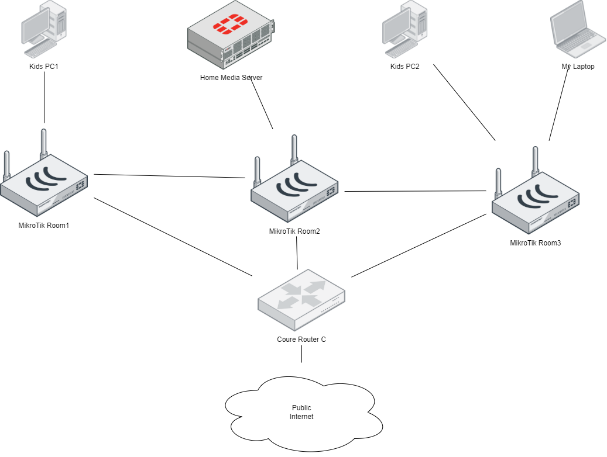

### 1. Подключитесь к публичному маршрутизатору в интернет. Найдите маршрут к вашему публичному IP
		telnet route-views.routeviews.org
		Username: rviews
		show ip route x.x.x.x/32
		show bgp x.x.x.x/32
```telnet		
route-views>show ip route 194.190.***.**
Routing entry for 194.190.111.0/24
  Known via "bgp 6447", distance 20, metric 0
  Tag 3356, type external
  Last update from 4.68.4.46 4w3d ago
  Routing Descriptor Blocks:
  * 4.68.4.46, from 4.68.4.46, 4w3d ago
      Route metric is 0, traffic share count is 1
      AS Hops 3
      Route tag 3356
      MPLS label: none

route-views>show bgp 194.190.***.**
BGP routing table entry for 194.190.***.0/24, version 2652263594
Paths: (19 available, best #14, table default)
  Not advertised to any peer
  Refresh Epoch 1
  3333 1103 12389 49886
    193.0.0.56 from 193.0.0.56 (193.0.0.56)
      Origin IGP, localpref 100, valid, external
      path 7FE0DA4EACF8 RPKI State not found
      rx pathid: 0, tx pathid: 0
  Refresh Epoch 1
  
  ---cut---
  
    852 3356 12389 49886
    154.11.12.212 from 154.11.12.212 (96.1.209.43)
      Origin IGP, metric 0, localpref 100, valid, external
      path 7FE0E00D4FE8 RPKI State not found
      rx pathid: 0, tx pathid: 0
  Refresh Epoch 1
  1351 6939 12389 49886
    132.198.255.253 from 132.198.255.253 (132.198.255.253)
      Origin IGP, localpref 100, valid, external
      path 7FE12BF43C08 RPKI State not found
      rx pathid: 0, tx pathid: 0
  
```
		
### 2. Создайте dummy0 интерфейс в Ubuntu. Добавьте несколько статических маршрутов. Проверьте таблицу маршрутизации.

		Создание
		~ sudo su -
		# ip link add dummy0 type dummy
		# ip addr add 10.0.0.1/24 dev dummy0
		# ip route add 192.168.1.0/24 via 10.0.0.254 dev dummy0
		# ip route list
		Для сохранения настроек надо записать их в файл /etc/network/interfaces

### 3. Проверьте открытые TCP порты в Ubuntu, какие протоколы и приложения используют эти порты? Приведите несколько примеров.

```netstat
# ss -tnlp
State           Recv-Q          Send-Q                     Local Address:Port                      Peer Address:Port          Process
LISTEN          0               100                            127.0.0.1:25                             0.0.0.0:*              users:(("master",pid=1739,fd=13))
LISTEN          0               128                            127.0.0.1:6010                           0.0.0.0:*              users:(("sshd",pid=14263,fd=12))
LISTEN          0               50                               0.0.0.0:445                            0.0.0.0:*              users:(("smbd",pid=1783,fd=48))
LISTEN          0               50                               0.0.0.0:139                            0.0.0.0:*              users:(("smbd",pid=1783,fd=49))
LISTEN          0               511                              0.0.0.0:47123                          0.0.0.0:*              users:(("sockd",pid=1603,fd=8))
LISTEN          0               128                              0.0.0.0:22                             0.0.0.0:*              users:(("sshd",pid=1652,fd=3))
LISTEN          0               5                              127.0.0.1:631                            0.0.0.0:*              users:(("cupsd",pid=982,fd=8))
LISTEN          0               128                                [::1]:6010                              [::]:*              users:(("sshd",pid=14263,fd=11))
LISTEN          0               50                                  [::]:445                               [::]:*              users:(("smbd",pid=1783,fd=46))
LISTEN          0               50                                  [::]:139                               [::]:*              users:(("smbd",pid=1783,fd=47))
LISTEN          0               128                                 [::]:22                                [::]:*              users:(("sshd",pid=1652,fd=4))
LISTEN          0               5                                  [::1]:631                               [::]:*              users:(("cupsd",pid=982,fd=7))


```		

22/TCP sshd

139,445/TCP smbd

### 4. Проверьте используемые UDP сокеты в Ubuntu, какие протоколы и приложения используют эти порты?

```udp
# ss -unap
State           Recv-Q          Send-Q                   Local Address:Port                    Peer Address:Port         Process
UNCONN          0               0                        10.199.48.255:137                          0.0.0.0:*             users:(("nmbd",pid=1588,fd=17))
UNCONN          0               0                        10.199.48.120:137                          0.0.0.0:*             users:(("nmbd",pid=1588,fd=16))
UNCONN          0               0                              0.0.0.0:137                          0.0.0.0:*             users:(("nmbd",pid=1588,fd=14))
UNCONN          0               0                        10.199.48.255:138                          0.0.0.0:*             users:(("nmbd",pid=1588,fd=19))
UNCONN          0               0                        10.199.48.120:138                          0.0.0.0:*             users:(("nmbd",pid=1588,fd=18))
UNCONN          0               0                              0.0.0.0:138                          0.0.0.0:*             users:(("nmbd",pid=1588,fd=15))
UNCONN          0               0                              0.0.0.0:44730                        0.0.0.0:*             users:(("avahi-daemon",pid=981,fd=13))
UNCONN          0               0                              0.0.0.0:5353                         0.0.0.0:*             users:(("avahi-daemon",pid=981,fd=11))
UNCONN          0               0                                 [::]:51502                           [::]:*             users:(("avahi-daemon",pid=981,fd=14))
UNCONN          0               0                                 [::]:5353                            [::]:*             users:(("avahi-daemon",pid=981,fd=12))

```
137,138/UDP nmpd
5353/UDP avahi-daemon


### 5. Используя diagrams.net, создайте L3 диаграмму вашей домашней сети или любой другой сети, с которой вы работали.

